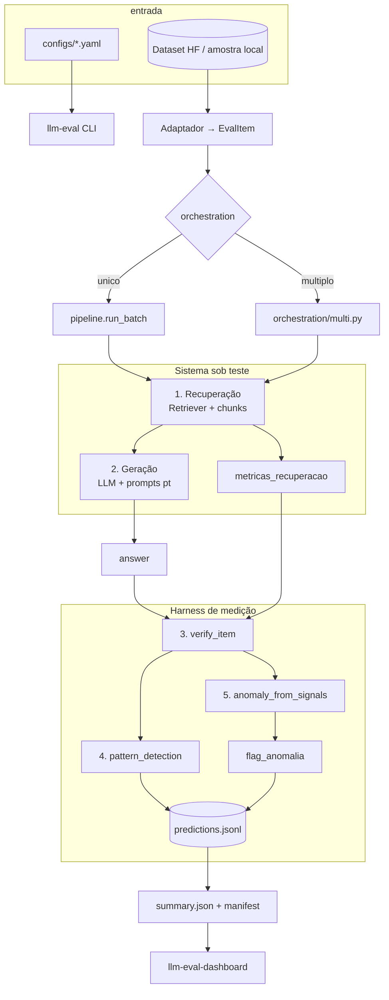
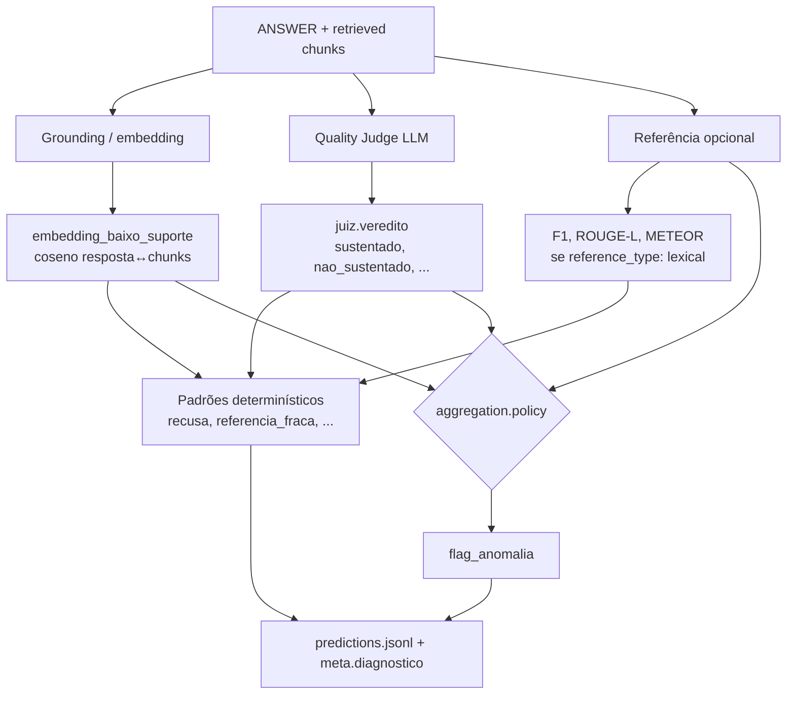
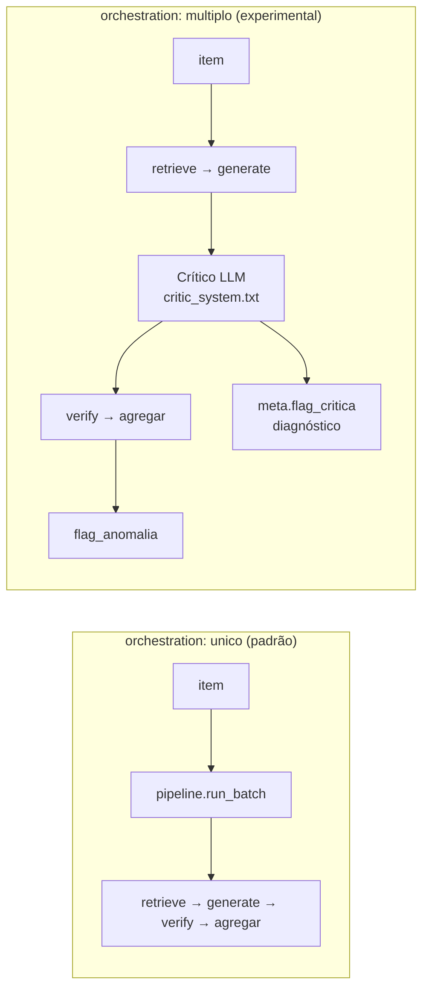

<div align="center">

# rag-eval-harness

**Harness reprodutível para avaliar pipelines RAG + LLM** — recuperação, geração, grounding, juiz e padrões determinísticos, com dashboard offline e artefactos auditáveis.

[](https://github.com/karysoares/rag-eval-harness/actions/workflows/ci.yml)
[](https://www.python.org/downloads/)
[](#qualidade)
[](#dashboard)

[Começar](#começar-em-2-minutos) · [Arquitetura](#arquitetura-da-pipeline) · [Orquestração](#orquestração) · [Dashboard](#dashboard) · [Documentação](#documentação)

</div>

---

## O que é

Laboratório de avaliação focado em **FairytaleQA pt-BR** ([`benjleite/FairytaleQA-translated-ptBR`](https://huggingface.co/datasets/benjleite/FairytaleQA-translated-ptBR)).

O repositório separa sempre:

| Camada | Papel | Exemplos no código |
|--------|--------|-------------------|
| **Adaptador** | Carregar o corpus → `EvalItem` | `adapters/`, `eval_items_load.py` |
| **Sistema sob teste** | Recuperar contexto e gerar resposta | `retrieval.py`, `generation.py` |
| **Harness de medição** | Sinais, padrões, agregação, relatório | `verification/`, `pattern_detection.py`, `reporting.py` |

Métricas de **recuperação** são **diagnósticas** (qualidade do contexto antes da resposta). Sinais pós-resposta (**embedding**, **juiz**, **referência léxica**) ficam **separados** até à política de agregação no YAML — não existe um único “score de verdade” universal.

**Por omissão:** [`configs/default.yaml`](configs/default.yaml) — 32 itens, RAG, `orchestration: unico`, prompts e juiz em português.

Documentação técnica (premissas, arquitectura, specs) está em [`docs/`](docs/) — versionada no repositório. Notas pessoais e relatórios internos ficam gitignored (ver `.gitignore`).

### Matriz KPI (três planos — não misturar)

| Plano | Bloco no `summary.json` | Uso |
|-------|-------------------------|-----|
| **A — Produto** | `sumario_lexical` | Qualidade face à referência do corpus |
| **B — Risco** | `sumario_operacional`, `n_anomalias_marcadas` | Alertas da política YAML |
| **C — HITL** | `sumario_hitl` | Calibração na amostra com `adjudicacao_humana` |

Comandos: `llm-eval --apply-hitl CSV --resume RUN_DIR` · `scripts/publish_run_evidence.py` (agregados publicáveis podem ser gerados localmente).

### Evidência e comparativos

Corpus activo: **FairytaleQA-translated-ptBR** (hub, N=1025) e **fairytale_ptbr** (amostra local, smoke/CI). Métricas vêm de `outputs/run_*/summary.json` (local) ou do snapshot [`assets/benchmarks/comparatives.json`](assets/benchmarks/comparatives.json).

**Referência actual (tuned, N=1025):** METEOR **0,901** · ROUGE-L **0,349** · juiz sustentado **78%** · `taxa_alerta` **0%** · recuperação **100%** (`configs/ptbr_fairytale_tuned.yaml`).

| Quando queres… | Eixo | Planos KPI |
|----------------|------|------------|
| Ver evolução baseline → tuned no mesmo corpus | **Interno** | A + B |
| Cruzar juiz/embedding com RAGAS | **Externo** | B |
| Provar que `embedding_e_juiz` reduz FP | **P0** | B |
| Calibrar com revisor humano | **HITL** | C |

Regenerar snapshot: `uv run python scripts/export_comparatives.py` · com RAGAS: `--ragas --ragas-n 25`

**Notas de leitura:** Plano A (léxico) ≠ Plano B (alertas/juiz). BLEU ~0,2 é normal em narrativa paráfrase — preferir METEOR. `% sustentado` baixo com `taxa_alerta` 0% pode reflectir vereditos `incompleto` (diagnóstico, não alerta). Corridas dev (N=32) e smoke (N=2) servem CI — **não** comparar com N=1025.

#### Eixo 1 — Evolução interna (N=1025, `embedding_e_juiz`)

Mesmo adaptador e split `validation`; variam YAML, calibração de embedding e parâmetros RAG/geração.

| Corrida | Config | METEOR | ROUGE-L | Juiz (% sust.) | Anomalias |
|---------|--------|--------|---------|----------------|-----------|
| baseline | `ptbr_fairytale_full` | 0,783 | 0,380 | 79,6% | 0% |
| calibrado | `ptbr_fairytale_full` | 0,823 | 0,366 | 95,4% | 1,5% |
| pós-calibração | `ptbr_fairytale_full` | 0,826 | 0,367 | 91,5% | 0,7% |
| **tuned** | **`ptbr_fairytale_tuned`** | **0,901** | 0,349 | 78,0% | **0%** |

Tuned maximiza METEOR e zera alertas operacionais; juiz “baixo” vs calibrado reflecte mais `incompleto` com RAG forte, não queda isolada de qualidade. Ajustes: `max_tokens: 256`, `reparar_recusa_generica`, `top_k: 5`, `chunk_max_chars: 650`, `embedding_min_cosine: 0.26`. Deltas: `uv run llm-eval --compare-runs outputs/run_<a> outputs/run_<b>`.

#### Eixo 2 — Harness vs RAGAS (N=25, mesma amostra)

Diagnóstico cruzado — **não** ground truth.

| Sinal | Harness | RAGAS |
|-------|---------|-------|
| Grounding | 72% juiz `sustentado` | faithfulness 0,82 |
| Relevância | F1 token 0,45 | answer_relevancy 0,94 |

Detalhes: [`docs/benchmarks/ragas_comparison.md`](docs/benchmarks/ragas_comparison.md).

#### Eixo 3 — Calibração P0

| Caso | FP `qualquer_critico` | FP `embedding_e_juiz` | P0 |
|------|------------------------|------------------------|-----|
| Fixture CI (`answer_lists`) | 100% | **0%** | passou |
| FairytaleQA tuned (`lexical`) | 3,0% | **0%** | passou |

Validação: `uv run python scripts/validate_embedding_policy.py outputs/run_<id>` · [`docs/calibracao_embedding.md`](docs/calibracao_embedding.md).

#### Eixo 4 — HITL (6 itens adjudicados)

Detector: 0 FP/FN vs humano. Juiz de agregação: 6 FP (humano marcou tudo `correto`). Fixture: [`tests/fixtures/hitl_fairytale_sample/`](tests/fixtures/hitl_fairytale_sample/) — calibração, não extrapolação ao corpus.

Métricas: [`docs/metrics.md`](docs/metrics.md) · publicar agregados: `uv run python scripts/publish_run_evidence.py outputs/run_<id>`.

### Trabalho relacionado

| Projeto | Foco | Ligação |
|---------|------|---------|
| **RAGAS** | Métricas RAG (faithfulness, context precision/recall) | [explodinggradients/ragas](https://github.com/explodinggradients/ragas) |
| **TruLens** | Observabilidade e feedback em apps LLM/RAG | [truera/trulens](https://github.com/truera/trulens) |
| **ARES** | Avaliação automática de sistemas RAG | [stanford-futuredata/ARES](https://github.com/stanford-futuredata/ARES) |
| **lm-evaluation-harness** | Benchmarks de LLM (não RAG end-to-end) | [EleutherAI/lm-evaluation-harness](https://github.com/EleutherAI/lm-evaluation-harness) |

Este harness complementa essas ferramentas com **verificação multicamada configurável**, **padrões determinísticos**, **fila HITL** e **artefactos auditáveis** orientados a FairytaleQA pt-BR. Integração opcional com RAGAS via extra `ragas` — comparativos versionados em [`assets/benchmarks/comparatives.json`](assets/benchmarks/comparatives.json).

---

## Arquitetura da pipeline

### Visão geral (por item)



### Fluxo detalhado pós-resposta

Depois de existir `answer`, o harness avalia **três ramos independentes** (cada um responde a uma pergunta diferente — não misturar KPIs):



| Ramo | Pergunta | Módulos | Campos em `predictions.jsonl` |
|------|----------|---------|-------------------------------|
| **Recuperação** (pré-geração) | O contexto certo chegou ao gerador? | `retrieval_metrics.py` | `meta.metricas_recuperacao.*` |
| **Grounding** | A resposta ancora-se ao que foi recuperado? | `embedding_verify.py` | `embedding_max_coseno`, `embedding_baixo_suporte` |
| **Juiz** | A resposta é sustentada, completa e segura? | `verification/judge.py` | `juiz.veredito`, `juiz_negativo` |
| **Referência** | Overlap com resposta curta do dataset? | `lexical_metrics.py`, `reference_metrics.py` | `meta.metricas_lexicas.*` |
| **Padrões** | Tags explicáveis (não alteram resposta) | `pattern_detection.py` | `meta.diagnostico` |
| **Agregação** | Quais sinais disparam **alerta**? | `aggregate.anomaly_from_signals` | `flag_anomalia` |

### Etapas por ordem de execução

1. **Carregar config + itens** — YAML reprodutível; `protocol.py` pode desligar RAG/embedding se não houver corpus.
2. **Chunks + retrieve** — `build_chunks_for_item` → `Retriever.retrieve(top_k)`; opcional injecção de falha (`inject_retrieval_failure`).
3. **Gerar resposta** — `generate_answer` com prompts canónicos em `src/llm_evaluation/prompts/responder_*` (espelhados em `prompts/` na raiz); saída JSON `{resposta, confianca, contexto_insuficiente}`; gate opcional se score &lt; `min_score_recuperacao` (resposta curada sem LLM).
4. **Verificar** — `verify_item`: gold (se activo), embedding, juiz RAG pt com metadados de recuperação.
5. **Agregar** — `anomaly_from_signals` conforme `aggregation.policy` e listas de vereditos.
6. **Diagnosticar** — `compute_diagnostico` (tiers, tags SPEC-007).
7. **Persistir** — `predictions.jsonl` linha a linha; no fim `summary.json`, `manifest.json`, `anomalies.*`.

### Políticas de agregação (`aggregation.policy`)

| Política | Comportamento típico |
|----------|----------------------|
| `qualquer_critico` | Alerta se **qualquer** camada activa disparar |
| `embedding_e_juiz` | Alerta só com **embedding baixo E juiz negativo** (menos FP por embedding isolado) |
| `todos_criticos` | Alerta só se **todas** as camadas activas dispararem |

Vereditos do juiz têm **dois níveis** no YAML:

- `negative_judge_verdicts` — diagnóstico e padrões (inclui `incompleto`).
- `judge_aggregation_verdicts` — só vereditos “duros” entram na agregação (`nao_sustentado`, `contradicacao`, `inseguro` por omissão).

Isto evita que `incompleto` domine os alertas quando o embedding também está baixo. Detalhe: política em `aggregation.policy` no YAML (ex.: `embedding_e_juiz`).

### Baselines (ablation)

`--compare-baselines` ou `--profile` isolam **uma** camada de verificação por corrida (`so_embeddings`, `so_juiz`, `hibrido`), com `verify_gold: false` em todos os perfis aplicados — para não confundir substring gold com sinal RAG.

`baselines.profile` no YAML é **só etiqueta** (`perfil_baseline` no JSONL); não altera `verify_*`. Use `llm-eval --profile …` ou `--compare-baselines` para ablação efectiva.

### Análise offline (sem API)

```bash
uv run llm-eval --analyze-run outputs/run_<id>
uv run python scripts/validate_embedding_policy.py outputs/run_<id>
```

Reconstrói `analise_camadas`, κ entre camadas, `sumario_gap_rag_resposta`, etc., a partir do JSONL (e `protocolo_ativo` em `summary.json` quando existir).

---

## Orquestração

`orchestration` (ou `orquestracao` no YAML) escolhe **como executar o loop por item**. Não altera adaptador, métricas nem política de agregação — só o caminho de **geração** (e, no modo multi, um passo extra).



| Modo | YAML / CLI | Módulo | O que faz |
|------|------------|--------|-----------|
| **`unico`** | `orchestration: unico` | `orchestration/single.py` → `pipeline.run_batch` | Caminho padrão, usado em todas as configs FairytaleQA |
| **`multiplo`** | `orchestration: multiplo` | `orchestration/multi.py` | Igual + **crítico** após a resposta; `meta.flag_critica` é diagnóstico — **não** altera `flag_anomalia` |

```bash
# Forçar na linha de comando (sobrepor o YAML)
uv run llm-eval --config configs/default.yaml --orchestration unico
uv run llm-eval --config configs/default.yaml --orchestration multiplo --experimental
```

**Quando usar `multiplo`:** experimentos “respondedor + revisor”; o crítico fica em `meta.critica` / `meta.flag_critica` para análise offline, sem entrar na agregação. Exige **`--experimental`** na CLI (ou YAML com `multiplo` falha sem a flag). **Não** está calibrado para produção — use só para experimentação offline.

`meta.orquestracao` no JSONL regista qual modo correu (`"unico"` ou `"multiplo"`).

---

## Dashboard

Interface **local** sobre `outputs/run_*` — análise **sem chamar API**. O separador **Revisão humana** permite anotar itens da fila e importar/exportar `adjudicacoes_hitl.csv` (gravação local na corrida; reprocessar com `--apply-hitl` ou botão no dashboard).

```bash
uv sync --extra dashboard
uv run llm-eval-dashboard
```

**Capturas de ecrã / GIF:** coloque ficheiros em [`assets/readme/`](assets/readme/) (ex.: `dashboard-overview.png`, `dashboard-demo.gif`) e referencie-os aqui. A pasta existe mas os assets ainda não foram gravados — útil para a página GitHub antes do release.

Separadores principais: **Visão geral** (KPI léxico + recuperação + operacional), **Calibração**, **Inspector Q/A**, **Padrões**, **Recuperação**, **Sinais** (κ entre camadas), **Referência**, **Revisão humana** (fila + HITL).

Variável opcional: `LLM_EVAL_OUTPUTS` (defeito: `outputs/`).

---

## Começar em 2 minutos

```bash
git clone https://github.com/karysoares/rag-eval-harness.git && cd rag-eval-harness
uv sync --extra dev --extra dashboard
cp .env.example .env   # OPENAI_API_KEY=... (só para corridas com API)
```

| Objetivo | Comando |
|----------|---------|
| Smoke rápido (2 itens, amostra local — sem Hub; CI usa mock, sem API) | `uv run pytest tests/test_pipeline_e2e_mock.py -q` |
| Smoke com API real (2 itens) | `uv run llm-eval --config configs/smoke_amostra.yaml` |
| FairytaleQA pt-BR + RAG (32) | `uv run llm-eval --config configs/default.yaml` |
| Corrida completa (validation, ~1025 itens) | `bash scripts/run_full_fairytale.sh` ou `uv run llm-eval --config configs/ptbr_fairytale_full.yaml` |
| **Corrida de referência optimizada** | `uv run llm-eval --config configs/ptbr_fairytale_tuned.yaml` (ver comentários no YAML) |
| Retomar corrida interrompida | `uv run llm-eval --config configs/ptbr_fairytale_full.yaml --resume outputs/run_<id>` |
| Ver quantos itens serão corridos | `uv run llm-eval --config configs/ptbr_fairytale_full.yaml --dry-run` |
| Abrir dashboard | `uv run llm-eval-dashboard` |
| Reanalisar última corrida | `uv run llm-eval --analyze-run outputs/run_<id>` |

> Corrida completa usa API (geração + juiz). Dashboard e `--analyze-run` funcionam **sem** API.

*Pacote **rag-eval-harness**; import Python `llm_evaluation`; CLI (`llm-eval`, `llm-eval-dashboard`) inalterados por compatibilidade.*

---

## CLI (`llm-eval`)

```bash
uv run llm-eval --config configs/default.yaml
uv run llm-eval --config configs/ptbr_fairytale_full.yaml --dry-run
uv run llm-eval --config configs/ptbr_fairytale_full.yaml
uv run llm-eval --config configs/ptbr_fairytale_full.yaml --resume outputs/run_<timestamp>
uv run llm-eval --compare-baselines --config configs/default.yaml
uv run llm-eval --analyze-run outputs/run_<timestamp>
uv run llm-eval --apply-hitl adjudicacoes_hitl.csv --resume outputs/run_<timestamp>
uv run llm-eval --compare-runs outputs/run_a outputs/run_b
uv run llm-eval --config configs/default.yaml --orchestration multiplo --experimental
uv run llm-eval --help
```

`--dry-run`, `--analyze-run`, `--apply-hitl` e `--compare-runs` **não** chamam a API de geração/juiz. Corridas normais exigem `OPENAI_API_KEY` (ver [`.env.example`](.env.example)).

**Ablação de baselines (uma variável por perfil):**

```bash
uv run llm-eval --profile so_embeddings --config configs/default.yaml
uv run llm-eval --profile so_juiz --config configs/default.yaml
uv run llm-eval --profile hibrido --config configs/default.yaml
```

---

## Artefactos

Cada corrida grava em `outputs/run_<UTC>/`:

| Ficheiro | Conteúdo |
|----------|----------|
| `predictions.jsonl` | Item a item: pergunta, resposta, chunks, `sinais`, `meta` (recuperação, léxico, diagnóstico, juiz) |
| `summary.json` | KPI, `protocolo_ativo`, `analise_camadas`, IC de Wilson, κ, sumários por camada |
| `manifest.json` | Hashes, metadados (git, config, prompts), integridade |
| `anomalies.jsonl` / `.csv` | Subconjunto com `flag_anomalia` |
| `analise_manual/fila_revisao_humana.csv` | Fila pós-corrida (juiz duro + recusas com RAG forte) |
| `adjudicacoes_hitl.csv` | Rótulos humanos (opcional; merge via `--apply-hitl`) |

`protocolo_ativo` no summary inclui camadas activas, política de agregação, limiar de embedding e listas de vereditos do juiz — para replay offline fiel.

Auditoria local: `uv run python scripts/audit_run.py outputs --strict` · publicar agregados: `uv run python scripts/publish_run_evidence.py outputs/run_<id>`

---

## Configurações

| Config | Uso |
|--------|-----|
| [`configs/default.yaml`](configs/default.yaml) | FairytaleQA pt-BR + RAG (**recomendado**, 32 itens) |
| [`configs/ptbr_fairytale_full.yaml`](configs/ptbr_fairytale_full.yaml) | Validation completo (`limit: 0`) |
| [`configs/ptbr_fairytale_tuned.yaml`](configs/ptbr_fairytale_tuned.yaml) | Validation completo — parâmetros calibrados para métricas + grounding |
| [`configs/smoke_amostra.yaml`](configs/smoke_amostra.yaml) | 2 itens offline (CI, sem Hub) |
| [`configs/ptbr_fairytale.yaml`](configs/ptbr_fairytale.yaml) | Alias com `limit: 64` |
| [`configs/baseline_*.yaml`](configs/baseline_embedding_only.yaml) | Ablation embedding / juiz |

**Chaves YAML com efeito real:**

| Secção | Chaves | Efeito |
|--------|--------|--------|
| `dataset` | `reference_type`, `hf_repo`, `limit`, `mode` | Tipo de referência e origem dos itens |
| `orchestration` | `unico` \| `multiplo` | Runner da corrida (ver [Orquestração](#orquestração)) |
| `rag` | `enabled`, `top_k`, `chunk_max_chars`, `min_score_recuperacao` | Recuperação e gate de geração |
| `verification` | `verify_*`, `embedding_min_cosine`, `negative_judge_verdicts`, `judge_aggregation_verdicts` | Camadas de sinal |
| `aggregation` | `policy` | Como combinar sinais em `flag_anomalia` |
| `patterns` | `referencia_forte`, `referencia_fraca` | Limiares F1 para tags SPEC-007 |
| `operacional` | `fila_min_score_recuperacao`, `gap_*` | Fila humana e detecção de gap RAG–resposta |
| `metricas_lexicas` | `habilitado`, flags por métrica | KPI principal em `reference_type: lexical` |
| `baselines` | `profile` | Etiqueta `perfil_baseline` (ablação via `--profile` ou `--compare-baselines`) |

---

## Estrutura do repositório

```
src/llm_evaluation/
  adapters/           # HF genérico + amostra local pt-BR → EvalItem
  orchestration/      # unico (→ pipeline) | multiplo (+ crítico)
  pipeline.py         # loop principal por item
  retrieval.py        # Retriever + embeddings
  generation.py       # prompts respondedor + hints de recuperação
  verification/       # gold, embedding, juiz, aggregate
  pattern_detection.py
  reporting.py        # summary.json
  evaluation_metrics.py  # analise_camadas, --analyze-run
  prompts/            # fonte canónica empacotada (respondedor + juiz pt-BR)
  dashboard/          # Streamlit local (análise + HITL)
configs/              # YAML reprodutíveis
tests/
```

---

## Documentação

Documentação técnica em [`docs/`](docs/) (arquitectura, premissas, specs, métricas). Relatórios internos e notas pessoais estão listados em `.gitignore`.

---

## Qualidade

```bash
uv run ruff check . && uv run ruff format --check .
uv run mypy src
uv run pytest -q
```

Integração Hub: `RUN_INTEGRATION=1 uv run pytest tests/integration -q`

---

## Licença

MIT — ver [`LICENSE`](LICENSE).

### Dataset FairytaleQA pt-BR

O corpus de referência [`benjleite/FairytaleQA-translated-ptBR`](https://huggingface.co/datasets/benjleite/FairytaleQA-translated-ptBR) é licenciado sob **Apache-2.0** (compatível com MIT para uso combinado; atribuição recomendada). O dataset original FairytaleQA está descrito em [Xu et al., ACL 2022](https://aclanthology.org/2022.acl-long.34); a tradução pt-BR em [Leite et al., ECTEL 2024](https://huggingface.co/datasets/benjleite/FairytaleQA-translated-ptBR#citation). Este repositório **não** redistribui o corpus — apenas consome-o via Hugging Face Hub.
