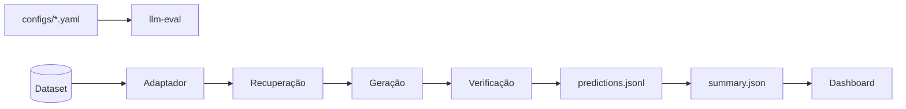

<div align="center">

# rag-eval-harness

**Harness reprodutível para avaliar pipelines RAG + LLM** — recuperação, geração, grounding, juiz LLM e padrões determinísticos, com dashboard offline e artefactos auditáveis.

[](https://github.com/karysoares/rag-eval-harness/actions/workflows/ci.yml)
[](https://www.python.org/downloads/)

[Getting started](#getting-started) · [Usage](#usage) · [Architecture](#architecture) · [Contributing](CONTRIBUTING.md)

</div>

---

## Overview

Harness de avaliação **agnóstico ao corpus**: cada dataset é um adaptador; o núcleo mede recuperação, geração e verificação em camadas independentes. O caso de referência incluído é **FairytaleQA pt-BR** ([`benjleite/FairytaleQA-translated-ptBR`](https://huggingface.co/datasets/benjleite/FairytaleQA-translated-ptBR)).

| Camada | Papel |
|--------|--------|
| **Adaptador** | Corpus → `EvalItem` |
| **Sistema sob teste** | Recuperação + geração |
| **Harness** | Sinais, padrões, agregação, relatório |

Métricas de recuperação são **diagnósticas**. Sinais pós-resposta (embedding, juiz, referência léxica) permanecem **separados** até à política de agregação no YAML — não há um único score universal.

## Features

- Pipeline reprodutível via YAML (`configs/`)
- Verificação multicamada: embedding (grounding), juiz RAG em português, referência léxica (F1, ROUGE-L, METEOR)
- Políticas de agregação configuráveis (`embedding_e_juiz`, `qualquer_critico`, …)
- Padrões determinísticos e fila de revisão humana (HITL)
- Dashboard Streamlit offline sobre `outputs/run_*`
- Artefactos auditáveis: `predictions.jsonl`, `summary.json`, `manifest.json`
- Integração opcional com [RAGAS](https://github.com/explodinggradients/ragas)

## Getting started

**Requisitos:** Python 3.11+, [uv](https://docs.astral.sh/uv/).

```bash
git clone https://github.com/karysoares/rag-eval-harness.git && cd rag-eval-harness
uv sync --extra dev --extra dashboard   # usa uv.lock versionado
cp .env.example .env   # OPENAI_API_KEY — só para corridas com API
```

| Objetivo | Comando |
|----------|---------|
| Smoke offline (sem API) | `uv run pytest tests/test_pipeline_e2e_mock.py -q` |
| Smoke com API (2 itens) | `uv run llm-eval --config configs/smoke_amostra.yaml` |
| Desenvolvimento (32 itens) | `uv run llm-eval --config configs/default.yaml` |
| Corpus completo (~1025 itens) | `uv run llm-eval --config configs/ptbr_fairytale_full.yaml` |
| Dashboard | `uv run llm-eval-dashboard` |

> Corridas com geração e juiz exigem `OPENAI_API_KEY`. Dashboard e `--analyze-run` funcionam sem API.

O pacote chama-se **rag-eval-harness**; o import Python é `llm_evaluation` (compatibilidade).

## Usage

```bash
# Corrida
uv run llm-eval --config configs/default.yaml

# Pré-visualizar itens
uv run llm-eval --config configs/ptbr_fairytale_full.yaml --dry-run

# Retomar corrida interrompida
uv run llm-eval --config configs/ptbr_fairytale_full.yaml --resume outputs/run_<id>

# Reanalisar artefactos (sem API)
uv run llm-eval --analyze-run outputs/run_<id>

# Comparar duas corridas
uv run llm-eval --compare-runs outputs/run_a outputs/run_b

# Aplicar adjudicações HITL
uv run llm-eval --apply-hitl adjudicacoes_hitl.csv --resume outputs/run_<id>
```

Ablation de baselines (`--profile so_embeddings`, `so_juiz`, `hibrido`) e orquestração experimental (`--orchestration multiplo --experimental`): ver `llm-eval --help`.

## Architecture



Três camadas de verificação pós-resposta — **grounding** (embedding), **juiz LLM** e **referência léxica** — combinam-se via `aggregation.policy` no YAML; métricas de recuperação são diagnósticas e não entram na agregação por defeito.

## Run outputs

Cada corrida grava em `outputs/run_<UTC>/`:

| Ficheiro | Conteúdo |
|----------|----------|
| `predictions.jsonl` | Resultado por item (resposta, sinais, diagnóstico) |
| `summary.json` | KPI agregados, `protocolo_ativo`, análise entre camadas |
| `manifest.json` | Hashes, metadados, integridade |
| `anomalies.jsonl` | Subconjunto com `flag_anomalia` |
| `analise_manual/fila_revisao_humana.csv` | Fila para revisão humana |

Auditoria: `uv run python scripts/audit_run.py outputs --strict`

## Configuration

| Config | Uso |
|--------|-----|
| [`configs/default.yaml`](configs/default.yaml) | FairytaleQA pt-BR, 32 itens (**recomendado**) |
| [`configs/ptbr_fairytale_full.yaml`](configs/ptbr_fairytale_full.yaml) | Validation completo |
| [`configs/ptbr_fairytale_tuned.yaml`](configs/ptbr_fairytale_tuned.yaml) | Validation completo, parâmetros calibrados |
| [`configs/smoke_amostra.yaml`](configs/smoke_amostra.yaml) | 2 itens offline (CI) |
| [`configs/baseline_*.yaml`](configs/baseline_embedding_only.yaml) | Ablation embedding / juiz |

Políticas de agregação: `qualquer_critico`, `embedding_e_juiz`, `todos_criticos`. Tipos de referência: `lexical`, `answer_lists`, `none` (chave `dataset.reference_type`).

## Dashboard

```bash
uv sync --extra dashboard
uv run llm-eval-dashboard
```

Interface local sobre `outputs/run_*` — KPI, inspector Q/A, calibração, padrões e revisão humana. Variável opcional: `LLM_EVAL_OUTPUTS` (defeito: `outputs/`).

## Benchmarks

Resultados agregados versionados em [`assets/benchmarks/comparatives.json`](assets/benchmarks/comparatives.json). Regenerar a partir de corridas locais: [`assets/benchmarks/README.md`](assets/benchmarks/README.md).

## Further reading

| Documento | Conteúdo |
|-----------|----------|
| [`CONTRIBUTING.md`](CONTRIBUTING.md) | Ambiente, testes e PRs |
| [`CHANGELOG.md`](CHANGELOG.md) | Histórico de versões |
| [`assets/benchmarks/README.md`](assets/benchmarks/README.md) | Comparativos e regeneração |

## Related projects

| Projeto | Foco |
|---------|------|
| [RAGAS](https://github.com/explodinggradients/ragas) | Métricas RAG (faithfulness, context precision/recall) |
| [TruLens](https://github.com/truera/trulens) | Observabilidade em apps LLM/RAG |
| [ARES](https://github.com/stanford-futuredata/ARES) | Avaliação automática de RAG |
| [lm-evaluation-harness](https://github.com/EleutherAI/lm-evaluation-harness) | Benchmarks de LLM (não RAG end-to-end) |

## License

MIT — ver [`LICENSE`](LICENSE).

O corpus [`benjleite/FairytaleQA-translated-ptBR`](https://huggingface.co/datasets/benjleite/FairytaleQA-translated-ptBR) é **Apache-2.0**; este repositório consome-o via Hugging Face Hub, sem redistribuição. Citação: [Xu et al., ACL 2022](https://aclanthology.org/2022.acl-long.34); tradução pt-BR: [Leite et al., ECTEL 2024](https://huggingface.co/datasets/benjleite/FairytaleQA-translated-ptBR#citation).
