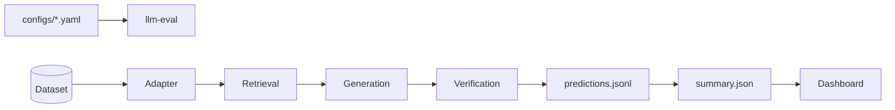

<div align="center">

# rag-eval-harness

**A reproducible harness for evaluating RAG + LLM pipelines** — retrieval, generation, grounding, LLM judge and deterministic patterns, with an offline dashboard and auditable artifacts.

[](https://github.com/karysoares/rag-eval-harness/actions/workflows/ci.yml)
[](https://www.python.org/downloads/)

[Getting started](#getting-started) · [Usage](#usage) · [Architecture](#architecture) · [Providers](#providers) · [Judge meta-evaluation](#judge-meta-evaluation) · [Contributing](CONTRIBUTING.md)

🇧🇷 [Leia em português](README.pt-BR.md)

</div>

---

## Overview

A **corpus-agnostic** evaluation harness: every dataset is an adapter, and the core measures retrieval, generation and verification as independent layers. The bundled reference case is **FairytaleQA pt-BR** ([`benjleite/FairytaleQA-translated-ptBR`](https://huggingface.co/datasets/benjleite/FairytaleQA-translated-ptBR)).

| Layer | Role |
|-------|------|
| **Adapter** | Corpus → `EvalItem` |
| **System under test** | Retrieval + generation |
| **Harness** | Signals, patterns, aggregation, reporting |

Retrieval metrics are **diagnostic**. Post-answer signals (embedding, judge, lexical reference) stay **separate** until the aggregation policy declared in YAML — there is no single universal score.

The prompts, the judge rubric and the reference corpus are Portuguese; the code, configuration and reports are language-neutral.

## Features

- Reproducible pipeline driven by YAML (`configs/`)
- Multi-layer verification: embedding (grounding), Portuguese RAG judge, lexical reference (F1, ROUGE-L, METEOR)
- Configurable aggregation policies (`embedding_e_juiz`, `qualquer_critico`, …)
- Deterministic patterns and a human review queue (HITL)
- **Judge meta-evaluation**: calibration, agreement, verbosity/position bias probes, self-consistency
- **Paired statistics** for run-to-run comparison (McNemar + paired bootstrap)
- **Telemetry** to Phoenix, LangSmith, CloudWatch or a local JSONL file
- Any OpenAI-compatible provider, with the judge on a **separate endpoint** (local Ollama/vLLM, DeepSeek, Qwen, OpenRouter)
- Offline Streamlit dashboard over `outputs/run_*`
- Auditable artifacts: `predictions.jsonl`, `summary.json`, `manifest.json`
- Optional [RAGAS](https://github.com/explodinggradients/ragas) integration

## Getting started

**Requirements:** Python 3.11+, [uv](https://docs.astral.sh/uv/).

```bash
git clone https://github.com/karysoares/rag-eval-harness.git && cd rag-eval-harness
uv sync --extra dev --extra dashboard   # uses the committed uv.lock
cp .env.example .env   # OPENAI_API_KEY — only needed for API runs
```

| Goal | Command |
|------|---------|
| Offline smoke (no API) | `uv run pytest tests/test_pipeline_e2e_mock.py -q` |
| API smoke (2 items) | `uv run llm-eval --config configs/smoke_amostra.yaml` |
| Development (32 items) | `uv run llm-eval --config configs/default.yaml` |
| Full corpus (~1025 items) | `uv run llm-eval --config configs/ptbr_fairytale_full.yaml` |
| Dashboard | `uv run llm-eval-dashboard` |

> Runs with generation and judging require `OPENAI_API_KEY`. The dashboard, `--analyze-run` and `--judge-report` work without it.

The distribution is named **rag-eval-harness**; the Python import is `llm_evaluation` (kept for compatibility).

## Usage

```bash
# Run
uv run llm-eval --config configs/default.yaml

# Preview items
uv run llm-eval --config configs/ptbr_fairytale_full.yaml --dry-run

# Resume an interrupted run
uv run llm-eval --config configs/ptbr_fairytale_full.yaml --resume outputs/run_<id>

# Re-analyse artifacts (no API)
uv run llm-eval --analyze-run outputs/run_<id>

# Compare two runs (paired statistics when they share items)
uv run llm-eval --compare-runs outputs/run_a outputs/run_b

# Meta-evaluate the judge (no API)
uv run llm-eval --judge-report outputs/run_<id>

# Apply HITL adjudications
uv run llm-eval --apply-hitl adjudicacoes_hitl.csv --resume outputs/run_<id>
```

Baseline ablation (`--profile so_embeddings`, `so_juiz`, `hibrido`) and experimental orchestration (`--orchestration multiplo --experimental`): see `llm-eval --help`.

## Architecture



Three post-answer verification layers — **grounding** (embedding), **LLM judge** and **lexical reference** — are combined through `aggregation.policy` in YAML; retrieval metrics are diagnostic and stay out of aggregation by default.

Full write-up in [`docs/ARCHITECTURE.md`](docs/ARCHITECTURE.md).

## Run outputs

Each run writes to `outputs/run_<UTC>/`:

| File | Contents |
|------|----------|
| `predictions.jsonl` | Per-item result (answer, signals, diagnosis) |
| `summary.json` | Aggregate KPIs, `protocolo_ativo`, cross-layer analysis |
| `manifest.json` | Hashes, metadata, integrity |
| `anomalies.jsonl` | Subset carrying `flag_anomalia` |
| `judge_report.json` | Judge meta-evaluation (via `--judge-report`) |
| `analise_manual/fila_revisao_humana.csv` | Human review queue |

Audit: `uv run python scripts/audit_run.py outputs --strict`

## Configuration

| Config | Use |
|--------|-----|
| [`configs/default.yaml`](configs/default.yaml) | FairytaleQA pt-BR, 32 items (**recommended**) |
| [`configs/ptbr_fairytale_full.yaml`](configs/ptbr_fairytale_full.yaml) | Full validation split |
| [`configs/ptbr_fairytale_tuned.yaml`](configs/ptbr_fairytale_tuned.yaml) | Full validation split, calibrated parameters |
| [`configs/smoke_amostra.yaml`](configs/smoke_amostra.yaml) | 2 offline items (CI) |
| [`configs/ptbr_fairytale_qwen_local.yaml`](configs/ptbr_fairytale_qwen_local.yaml) | 200 items, API generator + free local judge |
| [`configs/baseline_*.yaml`](configs/baseline_embedding_only.yaml) | Embedding / judge ablation |

Aggregation policies: `qualquer_critico`, `embedding_e_juiz`, `todos_criticos`. Reference types: `lexical`, `answer_lists`, `none` (key `dataset.reference_type`).

## Dashboard

```bash
uv sync --extra dashboard
uv run llm-eval-dashboard
```

A local interface over `outputs/run_*` — KPIs, Q/A inspector, calibration, patterns and human review. Optional variable: `LLM_EVAL_OUTPUTS` (default: `outputs/`).

## Providers

Any OpenAI-compatible endpoint works, and **the judge can run on a different provider from the generator** — set `JUDGE_BASE_URL` (and `JUDGE_API_KEY`) alongside `OPENAI_BASE_URL`. The base URL may or may not end in `/v1`; both forms resolve.

That split matters for two reasons. The judge dominates cost. Measured on a recorded 200-item run (`gpt-4o-mini` generator, `gpt-4o` judge, 380 calls):

| model | role | calls | prompt tokens | completion | cost |
|---|---|---|---|---|---|
| `gpt-4o` | judge | 189 | 571,437 | 18,143 | **$1.61** |
| `gpt-4o-mini` | generator | 191 | 481,455 | 8,218 | $0.08 |

The judge is 95% of the bill, and a full 1025-item run extrapolates to ~$8.65. Moving the judge to a local model removes almost all of it. The second reason is methodological: a judge from a different family than the generator is stronger, since a model grading its own output tends to prefer it.
Cost accounting is **per model**: a single price pair applied to a mixed generator/judge setup understated the run above by 9.7× ($0.17 reported against $1.69 actual). Set `LLM_EVAL_PRICES=gpt-4o-mini:0.15:0.60,gpt-4o:2.50:10.00` and `summary.json` carries `observabilidade.custo` broken down by model, flagging any model with no configured price rather than silently omitting it from the total. And a judge from a different family than the generator is methodologically stronger: a model grading its own output tends to prefer it. The run records both endpoints in `summary.json` → `protocolo_ativo.models`.

```bash
# Generator on a paid API, judge free and local
ollama pull qwen2.5:7b
```

```dotenv
LLM_MODEL=gpt-4o-mini
JUDGE_MODEL=qwen2.5:7b
JUDGE_BASE_URL=http://localhost:11434
JUDGE_API_KEY=ollama          # local endpoints ignore it but require one
```

```bash
uv run llm-eval --config configs/ptbr_fairytale_qwen_local.yaml
uv run llm-eval --judge-report outputs/run_<id>
```

Presets for Ollama, vLLM, DeepSeek, DashScope and OpenRouter are in [`.env.example`](.env.example).

**Choose a judge with the harness, not with intuition.** Four judges over the same 200 items (`configs/ptbr_fairytale_judge_ab.yaml`, same generator, paired by `id_item`):

| judge | n | accuracy | κ | ECE | mean conf. | `sustentado` | s/item |
|---|---|---|---|---|---|---|---|
| `gpt-4o` | 189 | 0.561 | −0.028 | 0.421 | 0.982 | 86.2% | 11.7 |
| `gpt-4o-mini` | 200 | 0.575 | −0.006 | 0.399 | 0.974 | 78.0% | 3.0 |
| **`gpt-5.4-nano`** | 200 | **0.610** | 0.092 | **0.296** | 0.906 | 76.5% | **2.5** |
| `qwen2.5` (Ollama) | 200 | 0.585 | **0.190** | 0.366 | 0.911 | 59.5% | 33.7 |

No pair differs significantly on alert rate (all p=1 after excluding execution failures). Read the columns separately: accuracy and κ are measured against a *lexical* reference, which asks a different question than the judge does, so κ near zero means the two signals are independent rather than that the judge is wrong. Calibration is unambiguous — every judge declares 0.91–0.98 confidence while being right 56–61% of the time, so `confianca` is not usable as a triage threshold.

The costly model is not the good one: `gpt-4o` is last on every column and 9.3× the price of `gpt-4o-mini`. The local judge keeps the highest κ and the lowest approval rate, at zero cost and 13× the latency.

Full aggregates, including per-model token usage and the paired tests: [`docs/evidencia/judge_ab_fairytale_200.json`](docs/evidencia/judge_ab_fairytale_200.json).

Two failure modes this table exposes, both silent without `--judge-report`: a small model that approves everything scores well on a short test (`qwen2.5:3b` answered `nao_sustentado` to all three smoke cases), and a model that never returns the schema falls back to the heuristic, which defaults to `sustentado` (`mistral:7b`, and `gpt-5-mini` before the client learned to retry without an unsupported `temperature`).

Misconfiguration fails fast and quotes the provider: a wrong model name surfaces as `HTTP 404 … model 'qwen2.5:7b' not found` on the first attempt rather than after three silent retries.

## Judge meta-evaluation

An LLM judge is a measurement instrument, and an instrument has to be characterised before its readings mean anything. `reporting._judge_summary` answers *did the judge run cleanly?* (fallbacks, retries, invalid schema). [`judge_meta.py`](src/llm_evaluation/judge_meta.py) answers the harder question: *can we trust what the judge measures?*

```bash
uv run llm-eval --judge-report outputs/run_<id>          # offline, no API
```

| Property | Question | Method |
|---|---|---|
| Calibration | When it says 0.9, is it right 90% of the time? | Expected/Maximum Calibration Error over reliability bins |
| Agreement | Does it match the available reference and the human? | 2×2 confusion, Cohen's κ, Wilson CI on accuracy |
| Verbosity bias | Does it approve long answers *for being long*? | Point-biserial correlation between approval and answer length |
| Position bias | Does it only approve when the gold chunk ranks first? | Approval rate by gold-chunk rank, with Wilson CIs |
| Self-consistency | Does it give the same verdict twice? | Fleiss' κ + unanimity rate over repeated samples |

Self-consistency needs fresh judge calls and lives in its own script:

```bash
uv run python scripts/judge_self_consistency.py outputs/run_<id> --amostras 5 --limite 40
uv run llm-eval --judge-report outputs/run_<id> --judge-samples outputs/run_<id>/judge_self_consistency.jsonl
```

It matters for more than tidiness: an unstable judge puts a floor under the minimum detectable effect. A difference between two runs that is smaller than the judge's own sampling noise is not interpretable, no matter how significant the p-value looks.

The report inherits the run's own policy rather than assuming one: which verdicts count as negative comes from `summary.json` → `protocolo_ativo.judge_aggregation_verdicts`, and the lexical threshold from `pattern_settings.f1_fraca_min`. Otherwise an advisory verdict like `incompleto` — which never raises `flag_anomalia` — would be scored as a judge false negative. The effective polarity and its source are reported under `polaridade_vereditos`.

Human reference labels (HITL) take precedence over automatic ones when both exist for an item. Verdicts produced by the heuristic fallback are excluded throughout — a fallback is not a measurement by the judge — and so are items whose confidence was filled in during deserialisation rather than measured (`n_excluidos_sem_confianca`).

None of these probes proves bias on its own: answers that are longer may genuinely be better. They are inspection signals, and the reports say so in their own `nota` fields.

## Observability

Beyond the per-run accounting in `summary.json`, a run can stream traces and metrics to an external platform. Set `LLM_EVAL_TELEMETRY` to one or more targets:

| Target | Destination | Requires |
|---|---|---|
| `jsonl` | `telemetry.jsonl` inside the run directory | nothing |
| `phoenix` | Arize Phoenix over OTLP | `--extra observability` |
| `langsmith` | LangSmith OTLP endpoint | `--extra observability` + `LANGSMITH_API_KEY` |
| `otlp` | any OTLP collector (incl. ADOT → CloudWatch) | `--extra observability` |
| `cloudwatch` | CloudWatch metrics as EMF on stdout | CloudWatch agent |

```bash
uv sync --extra observability
LLM_EVAL_TELEMETRY=phoenix,cloudwatch uv run llm-eval --config configs/default.yaml
```

One contract, several adapters: a run holds items, an item holds LLM calls. Phoenix, LangSmith and CloudWatch all speak OTLP — Phoenix natively, LangSmith through its OTLP endpoint, CloudWatch through the ADOT collector — so a single exporter serves all three, with attribute names following OpenInference/OTel conventions (`llm.token_count.*`, `gen_ai.*`). CloudWatch gets a second adapter for *metrics*, emitting Embedded Metric Format on stdout so the agent converts them without AWS credentials ever entering the evaluation process.

Three invariants make this safe to leave on:

- **It never changes results.** `predictions.jsonl` and `summary.json` are identical with and without an exporter — there is a test that asserts exactly this.
- **It never breaks a run.** A backend that is down, a missing extra or a bad target produces one warning on `stderr` and the run continues. Failing an evaluation because of its instrumentation trades the goal for the instrument.
- **It exports no content by default.** Questions, answers and context stay out unless `LLM_EVAL_TELEMETRY_CONTENT=1`. An observability endpoint is one more place the corpus comes to exist, often outside the control of whoever runs the evaluation.

`jsonl` is the reference target: it shows exactly what would be sent, with no network — useful before wiring a backend, and in CI. Details in [`docs/specs/011-telemetry.md`](docs/specs/011-telemetry.md).

## Performance

Per-item work is dominated by API latency, not CPU. `llm.concurrency` (or `LLM_EVAL_CONCURRENCY`) processes items on a thread pool; the order and contents of `predictions.jsonl` do **not** depend on the value — `on_record` is always called in dataset order, on a single thread.

```yaml
llm:
  timeout_seconds: 120
  concurrency: 4     # 1 = sequential (default)
```

Measured with a 150 ms mock per call, 60 items over 10 documents (`generator + judge` per item — the shape of FairytaleQA):

| Concurrency | Time | Speedup |
|---|---|---|
| 1 (default) | 19.0 s | 1.0× |
| 4 | 4.8 s | 4.0× |
| 8 | 2.6 s | 7.3× |

Three optimisations carry this:

| Optimisation | Where | Effect |
|---|---|---|
| Item pool | `pipeline.run_batch` | overlaps API latency across items |
| Keep-alive HTTP pool | `llm_client.OpenAiCompatibleClient` | removes one TLS handshake per call (~2000 in a 1025-item run) |
| Embedding cache | `retrieval.CachingEmbedder` | 84.8% hit rate in the scenario above; deduplicates chunks across items and between retrieval and verification |

Raising concurrency raises rate-limit pressure; the client backs off with jitter and honours `Retry-After`. Token and latency accounting is thread-local, so `meta.observabilidade` stays per-item.

## Statistical methods

| Use | Method | Implementation |
|---|---|---|
| Uncertainty on proportions (recall, false alarm) | Wilson interval | `statistics.wilson_ci` |
| Agreement between verification layers | Cohen's κ | `statistics.cohen_kappa` |
| Difference between runs **over the same items** | McNemar (exact or χ² with continuity correction) + paired bootstrap | `statistics.mcnemar_test`, `paired_bootstrap_diff_ci` |
| Difference between runs with no shared items | Two-proportion z test | `evaluation_metrics._pairwise_significance` |
| Judge confidence calibration | ECE / MCE over reliability bins | `statistics.expected_calibration_error` |
| Agreement across repeated judge samples | Fleiss' κ | `statistics.fleiss_kappa` |

`--compare-runs` aligns runs by `id_item` and emits `significancia_emparelhada` whenever they overlap. Comparing two configurations on the same dataset is a paired design: the unpaired test overestimates the standard error and loses power, so it is reserved for runs with no items in common.

## Benchmarks

Aggregate results are versioned in [`assets/benchmarks/comparatives.json`](assets/benchmarks/comparatives.json). Regenerate from local runs: [`assets/benchmarks/README.md`](assets/benchmarks/README.md).

## Further reading

| Document | Contents |
|----------|----------|
| [`docs/`](docs/README.md) | Architecture, verifiable specs, ADRs and technique notes |
| [`docs/ARCHITECTURE.md`](docs/ARCHITECTURE.md) | Verification layers and the system ↔ harness boundary |
| [`docs/decisions/`](docs/decisions/README.md) | ADRs (reference types, hybrid aggregation, HITL planes) |
| [`CONTRIBUTING.md`](CONTRIBUTING.md) | Environment, tests and PRs |
| [`CHANGELOG.md`](CHANGELOG.md) | Version history |
| [`assets/benchmarks/README.md`](assets/benchmarks/README.md) | Comparatives and regeneration |

Note: the documents under `docs/` are written in Portuguese, matching the corpus and prompts.

## Related projects

| Project | Focus |
|---------|-------|
| [RAGAS](https://github.com/explodinggradients/ragas) | RAG metrics (faithfulness, context precision/recall) |
| [TruLens](https://github.com/truera/trulens) | Observability for LLM/RAG apps |
| [ARES](https://github.com/stanford-futuredata/ARES) | Automated RAG evaluation |
| [lm-evaluation-harness](https://github.com/EleutherAI/lm-evaluation-harness) | LLM benchmarks (not end-to-end RAG) |

## License

MIT — see [`LICENSE`](LICENSE).

The [`benjleite/FairytaleQA-translated-ptBR`](https://huggingface.co/datasets/benjleite/FairytaleQA-translated-ptBR) corpus is **Apache-2.0**; this repository consumes it through the Hugging Face Hub without redistributing it. Citation: [Xu et al., ACL 2022](https://aclanthology.org/2022.acl-long.34); pt-BR translation: [Leite et al., ECTEL 2024](https://huggingface.co/datasets/benjleite/FairytaleQA-translated-ptBR#citation).
