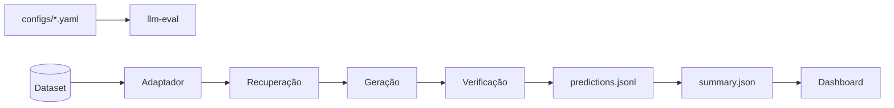

<div align="center">

# rag-eval-harness

**Harness reprodutível para avaliar pipelines RAG + LLM — e para avaliar o juiz que os avalia.**
Recuperação, geração, grounding, juiz LLM com calibração e sondas de viés, estatística emparelhada e artefactos auditáveis.

[](https://github.com/karysoares/rag-eval-harness/actions/workflows/ci.yml)
[](https://www.python.org/downloads/)

[Getting started](#getting-started) · [Usage](#usage) · [Architecture](#architecture) · [Fornecedores](#fornecedores) · [Meta-avaliação do juiz](#meta-avaliação-do-juiz) · [Contributing](CONTRIBUTING.md)

🇬🇧 [Read in English](README.md) — versão principal

</div>

---

## Overview

A maioria das ferramentas de avaliação RAG pontua a resposta. Esta também pontua **quem está a pontuar** — porque um juiz LLM é um instrumento, e um instrumento que ninguém caracterizou produz números sobre os quais ninguém devia decidir.

Juízes medidos com o próprio harness, sobre o caso de referência FairytaleQA pt-BR. Só se comparam braços em que **o juiz difere do gerador** — um modelo a corrigir o seu próprio trabalho não é uma comparação de juízes, e um braço que mudou duas variáveis também não. κ e ECE levam intervalos bootstrap, porque são as colunas sobre as quais a escolha de um juiz se argumentaria:

| juiz | gerador | n | exatidão | κ (IC 95%) | ECE (IC 95%) | conf. média | s/item |
|---|---|---|---|---|---|---|---|
| `gpt-4o` | `gpt-4o-mini` | 189 | 0,545 | −0,006 [−0,054, +0,043] | 0,437 [0,370, 0,510] | 0,982 | 11,7 |
| `gpt-5.4-nano` | `gpt-4o-mini` | 200 | **0,595** | 0,084 [−0,000, +0,172] | **0,311** [0,248, 0,374] | 0,906 | **2,5** |
| `qwen2.5` (local, gratuito) | `gpt-4o-mini` | 93 ‡ | 0,667 | 0,292 [+0,084, +0,469] | 0,276 [0,187, 0,378] | 0,921 | ~24 |

Três resultados, e são os intervalos que os tornam dizíveis. **Nenhum braço de N completo concorda com a referência além do acaso** — os dois intervalos de κ contêm zero, logo com 200 itens estes juízes e a referência léxica são sinais independentes e não um a validar o outro. **Todos os juízes são sobreconfiantes**: 0,91–0,98 de confiança declarada contra 0,55–0,67 de exatidão, pelo que `confianca` não serve de triagem. E **o modelo caro é o pior** em exatidão, calibração e latência ao mesmo tempo — o `gpt-4o` fica último nas três e custa 9,3× o `gpt-4o-mini`.

‡ O braço local é uma corrida **parcial**: os créditos da API esgotaram-se ao item 94, pelo que cobre 93 de 200 como prefixo da ordem do dataset e não como amostra aleatória — no FairytaleQA, onde os itens se agrupam por história, um prefixo cobre menos histórias distintas. É o único braço cujo intervalo de κ exclui zero, o que é sugestivo e não estabelecido. [`docs/evidencia/judge_local_gerador_partilhado_93.json`](docs/evidencia/judge_local_gerador_partilhado_93.json).

Todos os valores são re-derivados através da normalização léxica portuguesa actual (`llm-eval --rescore-lexical`), e é por isso que diferem dos números publicados antes — a exatidão e o κ dependem da referência léxica, e o tokenizador anterior partia toda a palavra acentuada. [Ver como é medido](#meta-avaliação-do-juiz).

### Dois braços que não sustentam uma comparação de juízes

Ambos foram corridos, ambos estão gravados, e nenhum entra na tabela acima. Nomeá-los é o ponto: o que invalida uma comparação faz parte do resultado.

| braço | porque está excluído |
|---|---|
| `gpt-4o-mini` a julgar `gpt-4o-mini` | **Auto-avaliação.** O juiz é o modelo que produziu a resposta (`protocolo_ativo.models.judge_same_as_generator`), e um modelo a corrigir o seu próprio trabalho tende a preferi-lo. A sua taxa de aprovação de 0,780 não é comparável com um braço julgado por outra família. |
| `qwen2.5` a julgar `llama3.2` | **Duas variáveis ao mesmo tempo.** Variou juiz *e* gerador, pelo que o seu κ de 0,229 era igualmente compatível com um gerador mais fraco a produzir respostas mais fracas. A repetição parcial acima separa-as: o F1 médio nos mesmos itens sobe de 0,282 para 0,357 com o gerador partilhado, logo o gerador explicava boa parte da diferença. |

Por baixo está um harness **agnóstico ao corpus**: cada dataset é um adaptador; o núcleo mede recuperação, geração e verificação em camadas independentes. O caso de referência incluído é **FairytaleQA pt-BR** ([`benjleite/FairytaleQA-translated-ptBR`](https://huggingface.co/datasets/benjleite/FairytaleQA-translated-ptBR)).

| Camada | Papel |
|--------|--------|
| **Adaptador** | Corpus → `EvalItem` |
| **Sistema sob teste** | Recuperação + geração |
| **Harness** | Sinais, padrões, agregação, relatório |

Métricas de recuperação são **diagnósticas**. Sinais pós-resposta (embedding, juiz, referência léxica) permanecem **separados** até à política de agregação no YAML — não há um único score universal.

**Âmbito, dito sem rodeios.** O harness é neutro quanto à língua: código, configuração, métricas e relatórios não assumem língua nenhuma, e a normalização léxica recebe a língua do corpus como parâmetro (`metricas_lexicas.idioma`). Português é o *caso de referência incluído* — os seus prompts, a sua rubrica de juiz e o seu corpus. Esse corpus é narrativa infantil traduzida (pt-BR), que é uma fatia estreita da língua: não há aqui corpus pt-PT, nem domínio adulto ou profissional, e a divergência ortográfica pt-PT/pt-BR (`facto`/`fato`, `acção`/`ação`) **não** é tratada pelo normalizador léxico, pelo que uma resposta correcta em pt-PT pontua abaixo contra ouro pt-BR. O caso português é um exemplo trabalhado do método, não um benchmark para português.

## Features

- Pipeline reprodutível via YAML (`configs/`)
- Verificação multicamada: embedding (grounding), juiz LLM (rubrica RAG portuguesa ou uma neutra quanto ao domínio), referência léxica (F1, ROUGE-L; METEOR por opção explícita, ver abaixo)
- Políticas de agregação configuráveis (`embedding_e_juiz`, `qualquer_critico`, …)
- Padrões determinísticos e fila de revisão humana (HITL)
- **Meta-avaliação do juiz**: calibração, concordância, sondas de viés e auto-consistência
- **Estatística emparelhada** para comparar corridas (McNemar + bootstrap emparelhado)
- **Telemetria** para Phoenix, LangSmith, CloudWatch ou ficheiro JSONL local
- Qualquer fornecedor compatível com OpenAI, com o juiz em **endpoint separado** (Ollama/vLLM local, DeepSeek, Qwen, OpenRouter)
- Dashboard Streamlit offline sobre `outputs/run_*`
- Artefactos auditáveis: `predictions.jsonl`, `summary.json`, `manifest.json`
- Integração opcional com [RAGAS](https://github.com/explodinggradients/ragas)

## Getting started

**Requisitos:** Python 3.11+, [uv](https://docs.astral.sh/uv/).

```bash
git clone https://github.com/karysoares/rag-eval-harness.git && cd rag-eval-harness
uv sync --extra dev --extra dashboard   # usa uv.lock versionado
cp .env.example .env   # OPENAI_API_KEY — só para corridas com API
```

| Objetivo | Comando |
|----------|---------|
| Smoke offline (sem API) | `uv run pytest tests/test_pipeline_e2e_mock.py -q` |
| Smoke com API (2 itens) | `uv run llm-eval --config configs/smoke_amostra.yaml` |
| Desenvolvimento (32 itens) | `uv run llm-eval --config configs/default.yaml` |
| Corpus completo (~1025 itens) | `uv run llm-eval --config configs/ptbr_fairytale_full.yaml` |
| Dashboard | `uv run llm-eval-dashboard` |

> Corridas com geração e juiz exigem `OPENAI_API_KEY`. Dashboard, `--analyze-run` e `--judge-report` funcionam sem API.

O pacote chama-se **rag-eval-harness**; o import Python é `llm_evaluation` (compatibilidade).

## Usage

```bash
# Corrida
uv run llm-eval --config configs/default.yaml

# Pré-visualizar itens
uv run llm-eval --config configs/ptbr_fairytale_full.yaml --dry-run

# Retomar corrida interrompida
uv run llm-eval --config configs/ptbr_fairytale_full.yaml --resume outputs/run_<id>

# Reanalisar artefactos (sem API)
uv run llm-eval --analyze-run outputs/run_<id>

# Comparar duas corridas (estatística emparelhada quando partilham itens)
uv run llm-eval --compare-runs outputs/run_a outputs/run_b

# Meta-avaliar o juiz (sem API)
uv run llm-eval --judge-report outputs/run_<id>

# Aplicar adjudicações HITL
uv run llm-eval --apply-hitl adjudicacoes_hitl.csv --resume outputs/run_<id>
```

Ablation de baselines (`--profile so_embeddings`, `so_juiz`, `hibrido`) e orquestração experimental (`--orchestration multiplo --experimental`): ver `llm-eval --help`.

## Architecture



Três camadas de verificação pós-resposta — **grounding** (embedding), **juiz LLM** e **referência léxica** — combinam-se via `aggregation.policy` no YAML; métricas de recuperação são diagnósticas e não entram na agregação por defeito.

## Run outputs

Cada corrida grava em `outputs/run_<UTC>/`:

| Ficheiro | Conteúdo |
|----------|----------|
| `predictions.jsonl` | Resultado por item (resposta, sinais, diagnóstico) |
| `summary.json` | KPI agregados, `protocolo_ativo`, análise entre camadas |
| `manifest.json` | Hashes, metadados, integridade |
| `anomalies.jsonl` | Subconjunto com `flag_anomalia` |
| `judge_report.json` | Meta-avaliação do juiz (via `--judge-report`) |
| `analise_manual/fila_revisao_humana.csv` | Fila para revisão humana |

Auditoria: `uv run python scripts/audit_run.py outputs --strict`

## Configuration

| Config | Uso |
|--------|-----|
| [`configs/default.yaml`](configs/default.yaml) | FairytaleQA pt-BR, 32 itens (**recomendado**) |
| [`configs/ptbr_fairytale_full.yaml`](configs/ptbr_fairytale_full.yaml) | Validation completo |
| [`configs/ptbr_fairytale_tuned.yaml`](configs/ptbr_fairytale_tuned.yaml) | Validation completo, parâmetros calibrados |
| [`configs/smoke_amostra.yaml`](configs/smoke_amostra.yaml) | 2 itens offline (CI) |
| [`configs/ptbr_fairytale_qwen_local.yaml`](configs/ptbr_fairytale_qwen_local.yaml) | 200 itens, gerador em API + juiz local gratuito |
| [`configs/baseline_*.yaml`](configs/baseline_embedding_only.yaml) | Ablation embedding / juiz |

Políticas de agregação: `qualquer_critico`, `embedding_e_juiz`, `todos_criticos`. Tipos de referência: `lexical`, `answer_lists`, `none` (chave `dataset.reference_type`).

**Estilos de prompt.** `verification.judge_prompt_style` e `generation.estilo_prompt` aceitam quatro e três valores. Dois eixos importam: a língua, e se o prompt nomeia um domínio.

| Estilo | Língua | Domínio | Usar quando |
|---|---|---|---|
| `rag_pt` | português | narrativa (nomeia contos) | O caso de referência FairytaleQA incluído |
| `pt` | português | narrativa | Rubrica legada, sem RAG |
| `generic` | inglês | neutro | Um corpus não português, de qualquer área |
| `generic_pt` | português | neutro | **Um corpus português que não seja narrativa** |

O `generic_pt` existe porque os outros três impunham uma escolha: dizer ao juiz que avalia contos infantis, ou fazê-lo raciocinar em inglês sobre texto português — uma variável escondida na camada cujo κ este README publica. É o mais endurecido dos quatro: precedência explícita de vereditos, âncoras de confiança calibradas contra a sobreconfiança medida acima, doze casos de entrada patológica, anti-injection alargado (delimitadores falsificados, cabeçalhos `SISTEMA:` fingidos, JSON pré-preenchido), e a regra dura de que variantes ortográficas pt-PT/pt-BR (`facto`/`fato`, `acção`/`ação`) são a mesma palavra e nunca uma discrepância factual. Ver [`docs/specs/003-judge.md`](docs/specs/003-judge.md).

**Métricas léxicas e língua.** `metricas_lexicas.idioma` escolhe a normalização: `pt` (por omissão, o caso de referência) ou `en`, que reproduz o protocolo oficial do SQuAD byte a byte para que resultados ingleses publicados continuem comparáveis. O tokenizador do ROUGE é Unicode — o da biblioteca parte toda a palavra acentuada — e a normalização separa nos hífenes em vez de colar a ênclise (`deu-lhe` → `deu lhe`).

**O METEOR vem desligado, de propósito.** Precisa do corpus `wordnet` do NLTK, que o `uv sync` não instala, e sem ele só pontua pares quase idênticos. A sua média era por isso calculada sobre os 2% de itens mais fáceis e publicada ao lado do N completo. Ligá-lo exige agora o recurso (`python -m nltk.downloader wordnet omw-1.4`); `validate_protocol` recusa `meteor: true` sem ele, antes da primeira chamada paga. Cada média em `sumario_lexical` leva também o seu próprio denominador em `n_por_metrica`, porque métricas diferentes falham em itens diferentes.

## Dashboard

```bash
uv sync --extra dashboard
uv run llm-eval-dashboard
```

Interface local sobre `outputs/run_*` — KPI, inspector Q/A, calibração, padrões e revisão humana. Variável opcional: `LLM_EVAL_OUTPUTS` (defeito: `outputs/`).

## Fornecedores

Qualquer endpoint compatível com OpenAI serve, e **o juiz pode correr num fornecedor diferente do gerador** — basta `JUDGE_BASE_URL` (e `JUDGE_API_KEY`) além de `OPENAI_BASE_URL`. A base pode ou não terminar em `/v1`; ambas as formas resolvem.

A separação importa por duas razões. O juiz domina o custo. Medido numa corrida gravada de 200 itens (gerador `gpt-4o-mini`, juiz `gpt-4o`, 380 chamadas):

| modelo | papel | chamadas | tokens prompt | completion | custo |
|---|---|---|---|---|---|
| `gpt-4o` | juiz | 189 | 571 437 | 18 143 | **$1,61** |
| `gpt-4o-mini` | gerador | 191 | 481 455 | 8 218 | $0,08 |

O juiz é 95% da fatura, e uma corrida completa de 1025 itens extrapola para ~$8,65. Passá-lo para local elimina quase tudo. A segunda razão é metodológica: um juiz de família diferente do gerador é mais forte, já que um modelo que avalia as suas próprias respostas tende a preferi-las.
A contabilidade de custo é **por modelo**: um par único de preços aplicado a um setup misto subestimou a corrida acima em 9,7× ($0,17 reportado contra $1,69 real). Defina `LLM_EVAL_PRICES=gpt-4o-mini:0.15:0.60,gpt-4o:2.50:10.00` e o `summary.json` passa a trazer `observabilidade.custo` repartido por modelo, assinalando qualquer modelo sem preço configurado em vez de o omitir do total em silêncio. E um juiz de família diferente do gerador é metodologicamente mais forte: um modelo que avalia as suas próprias respostas tende a preferi-las. A corrida regista ambos os endpoints em `summary.json` → `protocolo_ativo.models`.

```bash
# Gerador em API paga, juiz local e gratuito
ollama pull qwen2.5:7b
```

```dotenv
LLM_MODEL=gpt-4o-mini
JUDGE_MODEL=qwen2.5:7b
JUDGE_BASE_URL=http://localhost:11434
JUDGE_API_KEY=ollama          # endpoints locais ignoram-na, mas exigem uma
```

```bash
uv run llm-eval --config configs/ptbr_fairytale_qwen_local.yaml
uv run llm-eval --judge-report outputs/run_<id>
```

Presets para Ollama, vLLM, DeepSeek, DashScope e OpenRouter em [`.env.example`](.env.example).

**Escolha o juiz com o harness, não por intuição.** Cinco braços sobre os mesmos 200 itens (`configs/ptbr_fairytale_judge_ab.yaml`, emparelhados por `id_item`), dos quais três são comparações de juiz válidas. Todos os valores re-derivados com a normalização léxica actual.

| juiz | gerador | n | exatidão | κ (IC 95%) | ECE (IC 95%) | conf. média | `sustentado` | s/item | válido? |
|---|---|---|---|---|---|---|---|---|---|
| `gpt-4o` | `gpt-4o-mini` | 189 | 0,545 | −0,006 [−0,054, +0,043] | 0,437 [0,370, 0,510] | 0,982 | 86,2% | 11,7 | sim |
| `gpt-5.4-nano` | `gpt-4o-mini` | 200 | **0,595** | 0,084 [−0,000, +0,172] | **0,311** [0,248, 0,374] | 0,906 | 76,5% | **2,5** | sim |
| `qwen2.5` (Ollama) | `gpt-4o-mini` | 93 | 0,667 | 0,292 [+0,084, +0,469] | 0,276 [0,187, 0,378] | 0,921 | 62,4% | ~24 | parcial |
| `gpt-4o-mini` | `gpt-4o-mini` | 200 | 0,545 | −0,008 [−0,049, +0,028] | 0,428 [0,361, 0,493] | 0,974 | 78,0% | 3,0 | **não** — auto-avaliação |
| `qwen2.5` (Ollama) | `llama3.2` | 200 | 0,610 | 0,229 [+0,111, +0,348] | 0,342 [0,275, 0,406] | 0,911 | 59,5% | 33,7 | **não** — juiz e gerador variaram |

Os intervalos são bootstrap sobre itens (`bootstrap_kappa_ci`, `bootstrap_ece_ci`). Os dois braços válidos de N completo têm intervalo de κ a atravessar zero: a ordenação aparente por κ não se sustenta com este N, e só o braço local parcial exclui zero. Nenhum par difere significativamente na taxa de alerta (todos p=1 depois de excluir falhas de execução, com ajuste de Holm nas comparações simultâneas — os braços formam uma família, não testes independentes). As colunas leem-se em separado: exatidão e κ são medidos contra uma referência *léxica*, que faz uma pergunta diferente da do juiz, por isso κ perto de zero significa que os dois sinais são independentes e não que o juiz erra. A calibração é a coluna inequívoca — todos declaram 0,91–0,98 de confiança acertando 55–67%, portanto `confianca` não serve de limiar de triagem.

O modelo caro não é o bom: o `gpt-4o` fica último em exatidão, calibração e latência, a 9,3× o preço do `gpt-4o-mini`, e essa comparação é limpa — partilha o gerador e vem de outra família que ele.

Os dois braços inválidos ficam na tabela de propósito, marcados. Retirá-los esconderia o que foi realmente corrido; apresentá-los sem marca seria o erro. Ver a Overview para o motivo de cada exclusão.

Agregados completos, com uso de tokens por modelo e os testes emparelhados: [`docs/evidencia/judge_ab_fairytale_200.json`](docs/evidencia/judge_ab_fairytale_200.json).

Dois modos de falha que esta tabela expõe, ambos silenciosos sem `--judge-report`: um modelo pequeno que aprova tudo pontua bem num teste curto (o `qwen2.5:3b` respondeu `nao_sustentado` aos três casos do smoke), e um modelo que nunca devolve o schema cai no fallback heurístico, que por omissão diz `sustentado` (`mistral:7b`, e o `gpt-5-mini` antes de o cliente aprender a repetir sem um `temperature` não suportado).

Erros de configuração falham já e citam o fornecedor: um nome de modelo errado aparece como `HTTP 404 … model 'qwen2.5:7b' not found` à primeira tentativa, em vez de três repetições silenciosas.

## Meta-avaliação do juiz

Um juiz LLM é um instrumento de medição, e um instrumento precisa de ser caracterizado antes de as suas leituras significarem alguma coisa. `reporting._judge_summary` responde a *o juiz correu bem?* (fallbacks, retries, schema inválido). [`judge_meta.py`](src/llm_evaluation/judge_meta.py) responde à pergunta mais dura: *podemos confiar no que o juiz mede?*

```bash
uv run llm-eval --judge-report outputs/run_<id>          # offline, sem API
```

| Propriedade | Pergunta | Método |
|---|---|---|
| Calibração | Quando diz 0.9, acerta 90% das vezes? | ECE/MCE sobre bins de fiabilidade |
| Concordância | Bate com a referência disponível e com o humano? | Confusão 2×2, κ de Cohen, IC de Wilson na exatidão |
| Viés de verbosidade | Aprova respostas longas *por serem longas*? | Correlação ponto-bisserial entre aprovação e comprimento |
| Viés de posição | Só aprova com o chunk ouro em primeiro? | Taxa de aprovação por rank do ouro, com ICs de Wilson |
| Auto-consistência | Dá o mesmo veredito duas vezes? | κ de Fleiss + taxa de unanimidade sobre amostras repetidas |

A auto-consistência exige novas chamadas ao juiz e vive num script próprio:

```bash
uv run python scripts/judge_self_consistency.py outputs/run_<id> --amostras 5 --limite 40
uv run llm-eval --judge-report outputs/run_<id> --judge-samples outputs/run_<id>/judge_self_consistency.jsonl
```

Importa por mais do que arrumação: um juiz instável impõe um piso ao efeito mínimo detetável. Uma diferença entre duas corridas menor que o ruído de amostragem do próprio juiz não é interpretável, por mais significativo que o p-valor pareça.

O relatório herda a política da própria corrida em vez de assumir uma: os vereditos negativos vêm de `summary.json` → `protocolo_ativo.judge_aggregation_verdicts` e o limiar léxico de `pattern_settings.f1_fraca_min`. Caso contrário, um veredito consultivo como `incompleto` — que nunca dispara `flag_anomalia` — seria contado como falso negativo do juiz. A polaridade efectiva e a sua origem saem em `polaridade_vereditos`.

A referência humana (HITL) tem precedência sobre a automática quando ambas existem para o item. Vereditos do fallback heurístico são excluídos em toda a análise — um fallback não é uma medição do juiz — e o mesmo vale para itens cuja confiança foi preenchida na desserialização em vez de medida (`n_excluidos_sem_confianca`).

Nenhuma destas sondas prova viés por si só: respostas mais longas podem ser genuinamente melhores. São sinais de inspeção, e os relatórios dizem-no nos próprios campos `nota`.

## Observabilidade

Além da contabilidade por corrida em `summary.json`, uma corrida pode enviar traces e métricas para uma plataforma externa. Defina `LLM_EVAL_TELEMETRY` com um ou mais destinos:

| Destino | Para onde | Requer |
|---|---|---|
| `jsonl` | `telemetry.jsonl` na pasta da corrida | nada |
| `phoenix` | Arize Phoenix via OTLP | `--extra observability` |
| `langsmith` | endpoint OTLP do LangSmith | `--extra observability` + `LANGSMITH_API_KEY` |
| `otlp` | qualquer coletor OTLP (inclui ADOT → CloudWatch) | `--extra observability` |
| `cloudwatch` | métricas CloudWatch em EMF no stdout | agente CloudWatch |

```bash
uv sync --extra observability
LLM_EVAL_TELEMETRY=phoenix,cloudwatch uv run llm-eval --config configs/default.yaml
```

Um contrato, vários adaptadores: uma corrida contém itens, um item contém chamadas LLM. Phoenix, LangSmith e CloudWatch falam todos OTLP — Phoenix nativamente, LangSmith pelo seu endpoint OTLP, CloudWatch pelo coletor ADOT — pelo que um só exportador serve os três, com nomes de atributos segundo as convenções OpenInference/OTel (`llm.token_count.*`, `gen_ai.*`). O CloudWatch tem um segundo adaptador para *métricas*, que emite Embedded Metric Format no stdout para o agente converter, sem que credenciais AWS entrem no processo de avaliação.

Três invariantes tornam isto seguro de deixar ligado:

- **Nunca altera resultados.** `predictions.jsonl` e `summary.json` são idênticos com e sem exportador — há um teste que o afirma.
- **Nunca derruba a corrida.** Backend em baixo, extra em falta ou destino errado produzem um aviso em `stderr` e a corrida continua. Falhar uma avaliação por causa da sua instrumentação é trocar o objectivo pelo instrumento.
- **Não exporta conteúdo por omissão.** Perguntas, respostas e contexto ficam de fora salvo `LLM_EVAL_TELEMETRY_CONTENT=1`. Um endpoint de observabilidade é mais um sítio onde o corpus passa a existir, muitas vezes fora do controlo de quem corre a avaliação.

`jsonl` é o destino de referência: mostra exactamente o que seria enviado, sem rede — útil antes de ligar um backend, e em CI. Detalhes em [`docs/specs/011-telemetry.md`](docs/specs/011-telemetry.md).

## Performance

O trabalho por item é dominado por latência de API, não por CPU. `llm.concurrency`
(ou `LLM_EVAL_CONCURRENCY`) processa itens num pool de threads; a ordem e o conteúdo
de `predictions.jsonl` **não** dependem do valor — `on_record` é sempre chamado pela
ordem do dataset, numa única thread.

```yaml
llm:
  timeout_seconds: 120
  concurrency: 4     # 1 = sequencial (padrão)
```

Medido com `scripts/bench_concurrency.py`: mock de 150 ms por chamada, 60 itens sobre 10 documentos, duas chamadas por item (gerador + juiz — a forma do FairytaleQA). Reproduzir com `uv run python scripts/bench_concurrency.py`; saída gravada em [`docs/evidencia/bench_concorrencia.json`](docs/evidencia/bench_concorrencia.json).

| Concorrência | Tempo | Aceleração |
|---|---|---|
| 1 (padrão) | 18,95 s | 1,0× |
| 4 | 4,76 s | 3,98× |
| 8 | 2,56 s | 7,40× |

O mock mede a sobreposição de latência entre itens, não a velocidade do modelo, pelo que a aceleração é um tecto — atingível só enquanto o fornecedor não impuser limite de taxa.

Três otimizações sustentam isto:

| Otimização | Onde | Efeito |
|---|---|---|
| Pool de itens | `pipeline.run_batch` | sobrepõe a latência de API entre itens |
| Pool HTTP keep-alive | `llm_client.OpenAiCompatibleClient` | elimina 1 handshake TLS por chamada (~2050 numa corrida de 1025 itens — *derivado*: 2 chamadas × 1025 itens, não medido) |
| Cache de embeddings | `retrieval.CachingEmbedder` | 84,7% de acerto no cenário acima (508 acertos / 92 faltas, igual em qualquer concorrência); deduplica chunks entre itens e entre recuperação e verificação |

Subir a concorrência aumenta a pressão sobre o rate limit; o cliente faz backoff com
jitter e respeita `Retry-After`. Contabilização de tokens e latência é thread-local,
por isso `meta.observabilidade` continua a ser por item.

## Statistical methods

| Uso | Método | Implementação |
|---|---|---|
| Incerteza de proporções (revocação, falso alarme) | Intervalo de Wilson | `statistics.wilson_ci` |
| Concordância entre camadas de verificação | Cohen's κ | `statistics.cohen_kappa` |
| Diferença entre corridas **sobre os mesmos itens** | McNemar (exato ou χ² com correção) + bootstrap emparelhado | `statistics.mcnemar_test`, `paired_bootstrap_diff_ci` |
| Diferença entre corridas sem itens comuns | Teste z de duas proporções | `evaluation_metrics._pairwise_significance` |
| Calibração da confiança do juiz | ECE / MCE sobre bins de fiabilidade | `statistics.expected_calibration_error` |
| Concordância entre amostras repetidas do juiz | κ de Fleiss | `statistics.fleiss_kappa` |

`--compare-runs` alinha as corridas por `id_item` e emite `significancia_emparelhada`
quando há sobreposição. Comparar duas configurações sobre o mesmo dataset é um desenho
emparelhado: o teste não-emparelhado sobrestima o erro-padrão e perde poder, e por isso
fica reservado a corridas sem itens comuns.

## Benchmarks

Resultados agregados versionados em [`assets/benchmarks/comparatives.json`](assets/benchmarks/comparatives.json). Regenerar a partir de corridas locais: [`assets/benchmarks/README.md`](assets/benchmarks/README.md).

## Further reading

| Documento | Conteúdo |
|-----------|----------|
| [`docs/`](docs/README.md) | Arquitetura, specs verificáveis, ADRs e fichas técnicas |
| [`docs/ARCHITECTURE.md`](docs/ARCHITECTURE.md) | Camadas de verificação e fronteira sistema ↔ harness |
| [`docs/decisions/`](docs/decisions/README.md) | ADRs (tipos de referência, agregação híbrida, planos HITL) |
| [`CONTRIBUTING.md`](CONTRIBUTING.md) | Ambiente, testes e PRs |
| [`CHANGELOG.md`](CHANGELOG.md) | Histórico de versões |
| [`assets/benchmarks/README.md`](assets/benchmarks/README.md) | Comparativos e regeneração |

## Related projects

| Projeto | Foco |
|---------|------|
| [RAGAS](https://github.com/explodinggradients/ragas) | Métricas RAG (faithfulness, context precision/recall) |
| [TruLens](https://github.com/truera/trulens) | Observabilidade em apps LLM/RAG |
| [ARES](https://github.com/stanford-futuredata/ARES) | Avaliação automática de RAG |
| [lm-evaluation-harness](https://github.com/EleutherAI/lm-evaluation-harness) | Benchmarks de LLM (não RAG end-to-end) |

## License

MIT — ver [`LICENSE`](LICENSE).

O corpus [`benjleite/FairytaleQA-translated-ptBR`](https://huggingface.co/datasets/benjleite/FairytaleQA-translated-ptBR) é **Apache-2.0**; este repositório consome-o via Hugging Face Hub, sem redistribuição. Citação: [Xu et al., ACL 2022](https://aclanthology.org/2022.acl-long.34); tradução pt-BR: [Leite et al., ECTEL 2024](https://huggingface.co/datasets/benjleite/FairytaleQA-translated-ptBR#citation).
