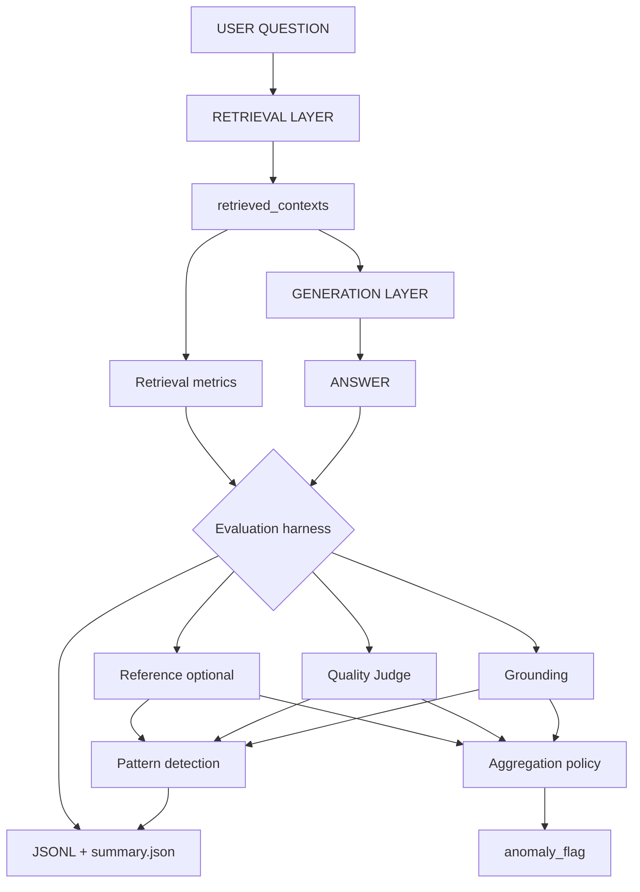
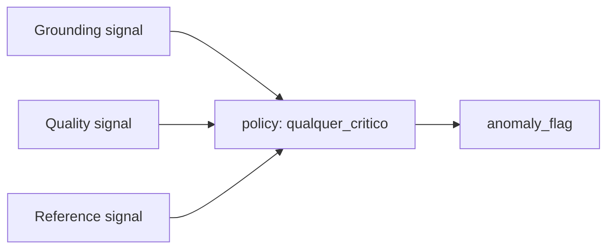
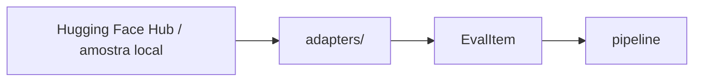
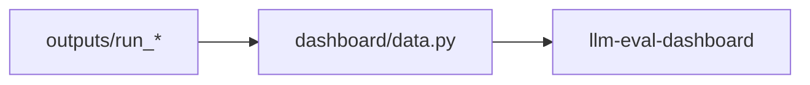

# Arquitetura de avaliação

Este documento descreve a separação entre o **sistema sob avaliação** (recuperação e geração) e o **harness de medição** (sinais de verificação, agregação e relatório), incluindo critérios para interpretação de métricas sem confundir diagnóstico com decisão de anomalia.

Ver também: [`PREMISSAS.md`](PREMISSAS.md) · [`metrics.md`](metrics.md)

## Fluxo ponta a ponta

## Sistema sob teste vs harness

| Zona | Componentes | Pergunta |
|------|-------------|----------|
| **Sistema** | `Retriever`, `generate_answer`, gate de recuperação fraca | O pipeline RAG+LLM produz uma resposta utilizável? |
| **Harness** | `verify_item`, `pattern_detection`, `anomaly_from_signals`, `reporting` | Quais sinais de risco, padrões explicáveis e qual política de alerta? |

O harness **não** altera a resposta (excepto geração curada quando o gate de recuperação dispara — documentado em `meta.qualidade_geracao`).

## Camada 1 — Retrieval (antes da geração)

Avalia a **qualidade do contexto** entregue ao gerador, independentemente da resposta final.

| Métrica | Definição | Campo em `predictions.jsonl` |
|---------|-----------|--------------------------------|
| Score do melhor chunk | Coseno pergunta ↔ top-1 | `meta.metricas_recuperacao.score_melhor_chunk` |
| Rank do chunk ouro | Posição 1-indexed do chunk `is_gold` no top-k; `null` se ausente | `meta.metricas_recuperacao.rank_chunk_ouro` |
| Chunk ouro no top-k | Booleano | `meta.metricas_recuperacao.chunk_ouro_no_top_k` |
| Gate recuperação fraca | Top score &lt; limiar YAML | `meta.qualidade_geracao.curada_por_recuperacao_fraca` |

**Implementação:** `src/llm_evaluation/retrieval_metrics.py`, invocado em `pipeline._run_one_with_resources`.

Agregados em `summary.json` → `sumario_recuperacao`.

## Camada 2 — Geração

- Entrada: pergunta + `retrieved_contexts`.
- Prompts canónicos: `src/llm_evaluation/prompts/responder_*.txt` (empacotados; `prompts/` na raiz é espelho para edição local — ver `prompt_resources.py` e `tests/test_prompt_parity.py`).
- Saída: `answer` extraída de JSON `{resposta, confianca, contexto_insuficiente}` (`generation.generate_answer`); metadados em `meta.qualidade_geracao`.
- Opcional: omitir LLM se recuperação fraca (`omitir_llm_se_recuperacao_fraca`).

## Camada 3 — Três ramos de avaliação (após `ANSWER`)

Cada ramo responde a uma pergunta **diferente**. Não misturar KPIs entre ramos.

### Grounding (ancoragem ao contexto)

| Aspecto | Conteúdo |
|---------|----------|
| **Pergunta** | A resposta está suportada pelo que foi recuperado? |
| **Técnicas** | Similaridade coseno resposta↔chunks; juiz com foco em aderência factual ao contexto |
| **Sinais** | `embedding_max_coseno`, `embedding_baixo_suporte`; vereditos `nao_sustentado`, `contradicacao` |
| **Limitação** | Coseno ≠ entailment; citações explícitas exigem formato estruturado na resposta |

**Módulos:** `verification/embedding_verify.py`, parte do juiz em `verification/judge.py`. Com RAG gold, o coseno face à passagem ouro (`embedding_max_coseno_ouro`) entra no máximo usado para `embedding_baixo_suporte` quando `embedding_use_gold_chunk: true`.

### Padrões determinísticos (pós-verificação)

Regras fixas em `pattern_detection.py` → `meta.diagnostico` (tags, `padrao_primario`, `tier_qualidade`). Servem o dashboard Inspector Q/A e `sumario_padroes`; **não** substituem o juiz nem a agregação de anomalias.

### Quality Judge (rubrica de qualidade)

| Aspecto | Conteúdo |
|---------|----------|
| **Pergunta** | A resposta é clara, completa e segura (incl. alucinação óbvia)? |
| **Técnicas** | LLM-as-judge, JSON estruturado, temperatura 0 |
| **Sinais** | `juiz.veredito`, `juiz_negativo` |
| **Regra** | Rubrica distinta da de grounding — evitar duplicar o mesmo critério nos dois prompts |

**Módulos:** `verification/judge.py`, `prompts/judge_*.txt`.

### Reference (opcional)

| Modo | Quando | Métricas |
|------|--------|----------|
| `answer_lists` | Listas `correct` / `incorrect` do adaptador | Protocolo em `verification/gold.py` |
| `lexical` | Referência textual fechada | BLEU, ROUGE-L, METEOR, Levenshtein (`metricas_lexicas`) |
| `none` | QA aberto sem gold | Ramo desligado na agregação; gold ainda pode ser calculado para diagnóstico |

**Regra:** reference **não** deve ser o único KPI do relatório quando o adaptador não define referência forte.

## Agregação e relatório

| Modo | Comportamento | Config |
|------|---------------|--------|
| **Diagnóstico** | Todos os sinais em `sinais` + `analise_camadas` | Sempre |
| **Alerta** | `anomaly_flag = OR(sinais críticos activos)` | `aggregation.policy: qualquer_critico` |
| **Ablation** | Um verificador por perfil baseline | `llm-eval --profile` ou `--compare-baselines` (`apply_baseline_profile`); `baselines.profile` no YAML só etiqueta |

Perfis baseline (`so_embeddings`, `so_juiz`) desligam **gold na agregação** para isolar uma variável; o rótulo gold pode continuar no JSONL para análise offline.

## Mapeamento código ↔ diagrama

| Diagrama | Código |
|----------|--------|
| RETRIEVAL LAYER | `retrieval.Retriever`, `datasets_rag.build_chunks_for_item` |
| Retrieval metrics | `retrieval_metrics.compute_retrieval_metrics` |
| GENERATION LAYER | `generation.generate_answer`, `pipeline.generate_answer_for_item` |
| Grounding | `embedding_verify`, `verify_embedding` |
| Quality Judge | `verification/judge.run_judge`, `verify_judge` |
| Reference | `verification/gold`, `lexical_metrics` |
| Aggregation | `verification/aggregate.anomaly_from_signals` |
| Relatório | `reporting.summarize`, `evaluation_metrics.layer_analysis` |

## Adaptador de dataset

`EvalItem` transporta pergunta, referências opcionais e `rag_gold_chunk` para métricas de retrieval. Novos corpora = novo mapeamento de colunas no YAML, não alteração do harness.

## Orquestração multi-agente

Modo `multiplo` acrescenta **crítico** (`orchestration/multi.py`): sinais em `meta.critica` e `meta.flag_critica` (**diagnóstico** — não alteram `flag_anomalia`). Tratar como experimento; calibrar antes de produção.

## Dashboard Streamlit

- **Comando:** `uv run llm-eval-dashboard` (extra `dashboard` no `pyproject.toml`).
- **Dados:** `predictions.jsonl` + `summary.json` / relatório reconstruído via `evaluation_metrics`.
- **Sem API** — só visualização e comparação de corridas.
- Spec: [`specs/006-dashboard.md`](specs/006-dashboard.md).

## Evolução prevista (não bloqueante)

- NLI / claim-level grounding (`docs/techniques/nli-and-claim-grounding.md`)
- Política `todos_criticos` em `aggregation.policy`
- Juiz com rubricas separadas `grounding` vs `quality` (dois prompts ou schema)
