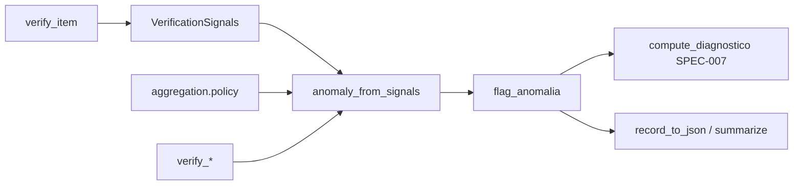

# SPEC-004: Agregação de anomalia e relatórios por camada

- **Estado:** implemented (v0.4 — políticas booleanas + `analise_camadas` + replay offline); **Fases A–E roadmap** (itens 1–10 abaixo)
- **Testes:** `tests/test_aggregate.py`, `tests/test_protocol.py`, `tests/test_evaluation_metrics.py`, `tests/test_policy_replay.py`, `tests/test_statistics.py`, `tests/test_pattern_detection.py`, `tests/test_reporting_summarize.py`
- **Relacionado:** [SPEC-001](001-retrieval.md) (gate recuperação fraca → FP estratificados), [SPEC-002](002-grounding.md) (`embedding_baixo_suporte`), [SPEC-003](003-judge.md) (`juiz_negativo`, fallback excluído da agregação), [SPEC-005](005-reporting.md) (`summary.json`), [SPEC-006](006-dashboard.md), [SPEC-007](007-pattern-detection.md) (`padrao_primario`, tag `anomalia`)

## Objetivo

Combinar sinais de verificação num **`flag_anomalia` booleano** por item, com **política explícita** no YAML (`aggregation.policy`) e camadas activáveis (`verification.verify_*`). O KPI primário de alerta na v1 permanece este booleano; scores contínuos, severidade e agregação por claim são **diagnóstico ou roadmap**, sem colapsar recuperação, grounding, juiz e referência do adaptador num único número.

**Premissas** (`docs/PREMISSAS.md`): harness agnóstico; referência (`gold_correto` / listas / léxico) define “erro” só para o protocolo activo; `meta.diagnostico` ([SPEC-007](007-pattern-detection.md)) explica *porquê* mas **não** substitui `flag_anomalia`.

## Entradas e saídas

### Configuração

| Chave | Tipo | Efeito |
|-------|------|--------|
| `verification.verify_gold` | bool | Inclui camada ouro na agregação |
| `verification.verify_embedding` | bool | Inclui `embedding_baixo_suporte` |
| `verification.verify_judge` | bool | Inclui juiz (com regras abaixo) |
| `verification.negative_judge_verdicts` | list[str] | Vereditos negativos (`veredito.py`) |
| `aggregation.policy` | enum | `qualquer_critico` \| `todos_criticos` \| `embedding_e_juiz` |
| `baselines.profile` | enum | **Só etiqueta** `perfil_baseline` na corrida normal |
| CLI `--profile` | string | Aplica `apply_baseline_profile` → altera `verify_*` |
| CLI `--compare-baselines` | flag | Quatro corridas (`nenhum`, `so_embeddings`, `so_juiz`, `hibrido`) |

Implementação: `verification/aggregate.py` (`anomaly_from_signals`, `signals_to_dict`); orquestração em `pipeline.py` / `orchestration/multi.py`; relatório em `reporting.summarize` + `evaluation_metrics.layer_analysis`.

### Por item (`predictions.jsonl`)

| Campo | Tipo | Descrição |
|-------|------|-----------|
| `flag_anomalia` | bool | Resultado da política + (opcional) crítico multi |
| `sinais` | object | Snapshot via `signals_to_dict` |
| `sinais.gold_incorreto` | bool \| null | Protocolo ouro ([SPEC-003](003-judge.md) / adaptador) |
| `sinais.embedding_baixo_suporte` | bool \| null | [SPEC-002](002-grounding.md); `null` se camada desligada |
| `sinais.juiz_negativo` | bool \| null | `null` se juiz em fallback heurístico |
| `perfil_baseline` | string | Valor de `baselines.profile` (etiqueta) |
| `diagnostico` | object | Padrões SPEC-007; tag `anomalia` espelha `flag_anomalia` |

### Por corrida (`summary.json`)

| Campo | Descrição |
|-------|-----------|
| `protocolo_ativo` | `{ verify_gold, verify_embedding, verify_judge, aggregation_policy, embedding_use_gold_chunk }` |
| `detector_activo` | Política + lista `camadas_verificacao` derivada do protocolo passado a `summarize` |
| `taxa_alerta`, `n_anomalias_marcadas` | Sobre `flag_anomalia` |
| `confusao_vs_referencia` | Matriz vs `gold_correto` (alias legado `confusao_vs_gold`) |
| `estratificacao_fp_gold_correto` | FP decompostos por embedding/juiz/gate recuperação |
| `analise_camadas` | Marginais, combinações, κ por camada e entre camadas |
| `sumario_juiz`, `sumario_padroes`, `sumario_recuperacao` | Ramos diagnósticos (não misturar em KPI único) |
| `ic95_*`, `cohen_kappa_anomalia_vs_gold` | `statistics.wilson_ci`, `statistics.cohen_kappa` |

## Camadas e gatilhos (semântica v0.4)

Função interna `_layer_triggers` → `(g, e, j)`:

| Símbolo | Condição (dispara quando True) |
|---------|--------------------------------|
| **g** | `verify_gold` **e** `gold_incorreto is True` |
| **e** | `verify_embedding` **e** `embedding_baixo_suporte is True` |
| **j** | `verify_judge` **e** `_judge_negative_for_aggregation(...)` |

**Juiz na agregação** (`_judge_negative_for_aggregation`):

1. Se `signals.judge is None` → **j = false**.
2. Se `judge.raw["fallback_heuristico"]` → **j = false** (mesmo que `juiz_negativo` esteja gravado no JSONL).
3. Caso contrário → `veredito_e_negativo(judge.veredito, negative_judge_verdicts)` ([`veredito.py`](../src/llm_evaluation/veredito.py)).

**Null / ausente (não disparam):**

| Campo | Valores que **não** disparam |
|-------|------------------------------|
| `gold_incorreto` | `False`, `None` |
| `embedding_baixo_suporte` | `False`, `None` |
| Juiz | ausente, fallback, veredito não listado em `negative_judge_verdicts` |

**Nota diagnóstico vs agregação:** `evaluation_metrics.layer_analysis` usa `juiz_negativo is True` nos marginais — inclui casos onde a agregação **ignora** o juiz (fallback). Para auditoria de política use `replay_anomaly_flags` / testes de `aggregate.py`.

## Políticas de agregação

Valores válidos: `config.AggregationPolicy` — apenas estes três; qualquer outro valor falha no load YAML.

### `qualquer_critico` (default histórico)

**Fórmula:** `flag_anomalia = g ∨ e ∨ j`

| g | e | j | `flag_anomalia` |
|---|---|---|-----------------|
| 0 | 0 | 0 | 0 |
| 1 | * | * | 1 |
| * | 1 | * | 1 |
| * | * | 1 | 1 |

Com todas as camadas desligadas (`verify_*` false): **g=e=j=0 → flag sempre false** (teste `test_no_anomaly_when_baselines_off`).

### `todos_criticos`

**Fórmula:** entre camadas **activas**, exige **todas** a disparar; se nenhuma camada activa → **false**.

Pseudo-código:

```text
checks = []
if verify_gold:    checks.append(g)
if verify_embedding: checks.append(e)
if verify_judge:  checks.append(j)
return checks não vazio AND all(checks)
```

**Tabela (três camadas activas):**

| g | e | j | `flag_anomalia` |
|---|---|---|-----------------|
| 1 | 1 | 1 | 1 |
| qualquer outra combinação com pelo menos um 0 | 0 |

**Uma camada activa:** equivale a essa camada isolada (AND de um único elemento).

### `embedding_e_juiz`

Desenhada para RAG ([`configs/nq_open_rag.yaml`](../../configs/nq_open_rag.yaml)): reduz FP só-embedding quando juiz sustenta a resposta.

**Fórmula (ordem no código):**

```text
if verify_embedding AND verify_judge:  return e AND j
elif verify_embedding:               return e
elif verify_judge:                   return j
elif verify_gold:                    return g
else:                                return false
```

**Tabela (embedding + juiz activos, gold off):**

| e | j | `flag_anomalia` |
|---|---|-----------------|
| 0 | 0 | 0 |
| 1 | 0 | 0 |
| 0 | 1 | 0 |
| 1 | 1 | 1 |

**Tabela (só embedding activo):** igual a `e`. **Só juiz:** igual a `j`. **Só gold (fallback da política):** igual a `g`.

## Modo `orquestracao: multiplo`

Em `orchestration/multi.py`, o crítico LLM corre **depois** da geração e grava sinais em `meta`:

```text
flag_anomalia = anomaly_from_signals(...)   # mesma política que unico
meta.flag_critica = critic_hook(...)      # diagnóstico; NÃO entra na agregação
```

- `flag_critica`: `true` quando `problemas` contém algo além de `nenhum`/`none`.
- Tratar como **experimento**; calibrar antes de confiar no crítico (`docs/ARCHITECTURE.md`).
- Modo `unico` (`pipeline.py`): **sem** passo de crítico.

## Perfis baseline: YAML vs CLI

| Mecanismo | Altera `verify_*` na corrida? | Onde aparece |
|-----------|-------------------------------|--------------|
| `baselines.profile` no YAML | **Não** (só etiqueta) | `perfil_baseline` em JSONL; `summary.perfil_baseline` |
| `llm-eval --profile X` | **Sim** (`apply_baseline_profile`) | Mesma corrida, protocolo efectivo alterado |
| `llm-eval --compare-baselines` | **Sim** (4 configs derivadas) | `predictions_{perfil}.jsonl`, `baseline_comparison.json` |

### `apply_baseline_profile` (`config.py`)

| Perfil | `verify_gold` | `verify_embedding` | `verify_judge` |
|--------|---------------|--------------------|----------------|
| `nenhum` | false | false | false |
| `so_embeddings` | false | true | false |
| `so_juiz` | false | false | true |
| `hibrido` | false | true | true |

`aggregation.policy` **não** muda com o perfil — só as camadas entram ou saem do OR/AND.

## Fluxo no pipeline



1. [SPEC-002](002-grounding.md) preenche embedding; [SPEC-003](003-judge.md) preenche juiz.
2. Agregação **não** relê métricas de recuperação nem padrões para decidir o flag (excepto indiretamente via sinais já calculados).
3. Gate recuperação fraca ([SPEC-001](001-retrieval.md)): não entra na fórmula; aparece em `estratificacao_fp_gold_correto.dos_quais_resposta_curada_por_gate_recuperacao`.

## Relação com SPEC-007 (explicabilidade v0.4)

| Artefacto | Papel |
|-----------|------|
| `flag_anomalia` | Decisão de alerta (política) |
| `diagnostico.padroes` | Tags determinísticas (`grounding_baixo`, `juiz_negativo`, `recuperacao_falhou`, …) |
| `diagnostico.padrao_primario` | Uma tag por prioridade fixa |
| `diagnostico.tier_qualidade` | `alta` \| `media` \| `baixa` \| `indeterminada` |
| tag `anomalia` | Presente sse `flag_anomalia` (espelho) |

Padrões **não** votam na agregação v1. Ligação futura: contribuição ponderada por tag (roadmap item 4).

## `analise_camadas` (implementado)

Fonte: `evaluation_metrics.layer_analysis` → chave `analise_camadas` em `reporting.summarize` (legado: `layer_analysis`).

| Bloco | Conteúdo |
|-------|----------|
| `gatilhos_marginais` | Contagens `gold_incorreto`, `embedding_baixo_suporte`, `juiz_negativo` (antes do OR da política) |
| `combinacoes_exclusivas_todos_itens` | Partição (g,e,j) ∈ {ouro_apenas, so_embedding, so_juiz, pares, tres_sinais, nenhum_sinal} |
| `combinacoes_exclusivas_so_anomalias` | Mesma partição restrita a `flag_anomalia=true` |
| `por_camada_vs_referencia` | VP/FP/FN/VN, precisão, revocação, `ic95_*`, `cohen_kappa_vs_gold` **por camada** vs referência incorreta |
| `concordancia_entre_camadas` | Cohen's κ par a par (ouro, embedding, juiz) |
| `nota_referencia` | Caveat: embedding/juiz medem grounding, não necessariamente o mesmo rótulo que ouro |

**Interpretação:** útil para **disagreement analysis** (item 6 do roadmap) em v0.4 via tabelas manuais; não há campo `discordancia_ouro_vs_juiz` dedicado no JSON.

## Estratificação e estatística no `summary.json`

| Campo | Função |
|-------|--------|
| `estratificacao_fp_gold_correto` | Decompõe FP quando referência automática está “correta” |
| `ic95_revocacao_marcacao_no_gold_incorreto` | Wilson sobre revocação no pool gold-incorreto |
| `ic95_taxa_falso_alarme_no_gold_correto` | Wilson sobre FP |
| `cohen_kappa_anomalia_vs_gold` | Concordância detector agregado vs referência |
| `qualidade_pipeline` | Curadoria por recuperação fraca (causal hint, não agregação) |

Funções: `statistics.wilson_ci`, `statistics.cohen_kappa` — sem dependências externas.

## Replay offline e comparação de políticas

Sem nova chamada API (`evaluation_metrics.py`):

| Função | Uso |
|--------|-----|
| `replay_anomaly_flags` | Reaplica `anomaly_from_signals` a JSONL existente |
| `recompute_embedding_low_support` | Sensibilidade ao limiar de coseno |
| `compare_aggregation_policies` | Tabela `qualquer_critico` vs `embedding_e_juiz` (taxa alerta, FP, κ) |
| `analyze_run_dir` / CLI `--analyze-run` | Reconstrói relatório com `analise_camadas` |

Script: `scripts/validate_embedding_policy.py` (políticas + limiar).

## Dashboard (SPEC-006)

**Implementado** (`dashboard/data.py`, `dashboard/app.py`):

- DataFrame com `flag_anomalia`, camadas, juiz (`juiz_confianca`, fallback, truncagem via `contexto_juiz`), recuperação, padrões, `tier_qualidade`.
- Vista calibração: `CALIBRATION_COLUMN_ORDER`.
- Filtro só anomalias; gráficos coloridos por `flag_anomalia`.
- Lê `protocolo_ativo` e `analise_camadas` do `summary.json` quando disponível.

**Planeado (roadmap item 10):** painéis de severidade, ECE por bin de confiança, comparação temporal entre corridas, heatmap de contribuição por camada.

## Configuração recomendada por protocolo

| Config | `aggregation.policy` | Camadas típicas | KPI primário (`summary`) |
|--------|----------------------|-----------------|--------------------------|
| `nq_open.yaml` | `qualquer_critico` | todas off (protocolo lexical) | `sumario_lexical` |
| `ptbr_fairytale_tuned.yaml` | `embedding_e_juiz` | embedding + juiz | léxico + `sumario_recuperacao` |
| `smoke_amostra.yaml` | `embedding_e_juiz` | conforme amostra local | léxico + camadas |
| `baseline_embedding_only.yaml` | herdada | só embedding via `--profile` | ablação |
| `baseline_judge_only.yaml` | herdada | só juiz via `--profile` | ablação |

`default.yaml` e `ptbr_fairytale_*.yaml` usam `embedding_e_juiz` com `reference_type: lexical`.

---

## Roadmap: evolução da agregação (itens 1–10)

Alinhamento sugerido com [SPEC-003](003-judge.md): **Fase A** = v0.4 actual; **B** = pós-juiz multidimensional (SPEC-003 Fase 2); **C** = calibração (SPEC-003 Fase 3–4); **D** = claims/NLI; **E** = política composável + drift.

Legenda: **Impl.** implementado; **Plan.** só especificado.

### Fase A — Booleano + camadas (v0.4) ✓

| # | Tema | Entregável | Estado |
|---|------|------------|--------|
| — | Políticas `qualquer_critico`, `todos_criticos`, `embedding_e_juiz` | `aggregate.anomaly_from_signals` | **Impl.** |
| — | Fallback juiz excluído da agregação | `_judge_negative_for_aggregation` | **Impl.** |
| — | `analise_camadas` + Wilson + κ | `layer_analysis`, `reporting.summarize` | **Impl.** |
| — | Estratificação FP | `estratificacao_fp_gold_correto` | **Impl.** |
| — | Replay / compare políticas | `evaluation_metrics` | **Impl.** |
| — | Padrões + tag `anomalia` | [SPEC-007](007-pattern-detection.md) | **Impl.** |
| — | Crítico multi OR | `orchestration/multi.py` | **Impl.** (experimental) |

### 1. Score contínuo (diagnóstico, não substitui flag)

| Item | Descrição | Estado |
|------|-----------|--------|
| 1a | `flag_anomalia` permanece KPI de alerta v1 | **Impl.** |
| 1b | Score composto ponderado (embedding, juiz confiança, gold) | **Plan.** |
| 1c | `score_camada_*` normalizado \[0,1\] no JSONL | **Plan.** |

### 2. Severidade (low / medium / high / critical)

| Item | Descrição | Estado |
|------|-----------|--------|
| 2a | `tier_qualidade` SPEC-007 (alta/media/baixa/indeterminada) | **Impl.** (proxy qualidade, não severidade de alerta) |
| 2b | Mapa determinístico sinais → `severidade_alerta` | **Plan.** |
| 2c | Severidade no dashboard e `anomalies.csv` | **Plan.** |

### 3. Agregação ao nível de claim

| Item | Descrição | Estado |
|------|-----------|--------|
| 3a | Vereditos por claim no juiz | **Plan.** (depende SPEC-003 + NLI em [SPEC-002](002-grounding.md)) |
| 3b | Roll-up claim → item (voto, max severidade) | **Plan.** |
| 3c | `flag_anomalia` derivado de claims com política documentada | **Plan.** |

### 4. Explicabilidade estruturada

| Item | Descrição | Estado |
|------|-----------|--------|
| 4a | Lista `padroes` + `padrao_primario` | **Impl.** |
| 4b | `contribuicao_camadas: {gold, embedding, juiz}` booleano por item | **Plan.** (hoje inferir de `sinais`) |
| 4c | Link explícito padrão ↔ camada que disparou política | **Plan.** |

### 5. Diagnóstico causal (correlação)

| Item | Descrição | Estado |
|------|-----------|--------|
| 5a | Contagem respostas curadas por gate recuperação | **Impl.** (`qualidade_pipeline`) |
| 5b | `sumario_juiz` (truncagem, schema, retry) | **Impl.** |
| 5c | Regressão / drivers automáticos (retrieval × embedding × juiz) | **Plan.** |

### 6. Análise de discordância

| Item | Descrição | Estado |
|------|-----------|--------|
| 6a | Matrizes por camada em `analise_camadas` | **Impl.** |
| 6b | κ entre camadas | **Impl.** |
| 6c | Tabela dedicada ouro vs juiz vs embedding vs flag | **Plan.** |
| 6d | Estratificação por `reference_type` / categoria adaptador | **Plan.** |

### 7. Drift temporal

| Item | Descrição | Estado |
|------|-----------|--------|
| 7a | `compare_metric_reports` entre corridas | **Impl.** (snapshot a snapshot) |
| 7b | Histórico de distribuições (`taxa_alerta`, marginais) | **Plan.** |
| 7c | Detecção de shift (KS / PSI) | **Plan.** |

### 8. Calibração de confiança do juiz

| Item | Descrição | Estado |
|------|-----------|--------|
| 8a | Campo `juiz_confianca` no dashboard | **Impl.** |
| 8b | Bins de confiança vs acerto (proxy gold) | **Plan.** (SPEC-003 Fase 3–4) |
| 8c | ECE / reliability diagram | **Plan.** |

### 9. DSL composável de políticas

| Item | Descrição | Estado |
|------|-----------|--------|
| 9a | Enum fixo de 3 políticas no YAML | **Impl.** |
| 9b | Linguagem de política (AND/OR/NOT ponderado) | **Plan.** |
| 9c | Validação estática + replay | **Plan.** |

### 10. Dashboards estatísticos ricos

| Item | Descrição | Estado |
|------|-----------|--------|
| 10a | Inspector Q/A + calibração | **Impl.** |
| 10b | IC Wilson e κ no summary | **Impl.** |
| 10c | Gráficos de camadas / políticas lado a lado | **Prog.** (compare baselines manual) |
| 10d | ECE, severidade, drift (itens 2, 7, 8) | **Plan.** |

---

## Fora de âmbito (v1)

- Votação ML sobre sinais sem spec de features e labels.
- Políticas YAML não implementadas em `AggregationPolicy`.
- Substituir `flag_anomalia` por `padrao_primario` ou `tier_qualidade` como KPI único.
- Agregar métricas de recuperação ([SPEC-001](001-retrieval.md)) directamente no booleano de anomalia.
- Claim-level / NLI sem contrato juiz ([SPEC-003](003-judge.md) nota futura + [SPEC-002](002-grounding.md)).

## Critérios de aceitação

### v0.4 (actual)

- [x] Três políticas implementadas e testadas unitariamente (`tests/test_aggregate.py`).
- [x] `nq_open_rag.yaml` usa `embedding_e_juiz`.
- [x] `summary.json` grava `protocolo_ativo` com `verify_*` e `aggregation_policy`.
- [x] `docs/metrics.md` lista políticas suportadas (sem políticas fantasma).
- [x] Fallback heurístico do juiz não dispara agregação (`test_judge_fallback_ignored_*`).
- [x] `analise_camadas` com Wilson, κ e combinações exclusivas (`tests/test_evaluation_metrics.py`).
- [x] Replay offline de políticas (`tests/test_policy_replay.py`).

### Roadmap (fases B–E)

- [ ] Score contínuo diagnóstico no JSONL sem alterar semântica do flag por defeito.
- [ ] Severidade de alerta mapeada e testada.
- [ ] Agregação claim-level com roll-up documentado.
- [ ] Contribuição por camada serializada por item.
- [ ] ECE / calibração de `confianca` do juiz.
- [ ] DSL de política ou extensão validada do enum.
- [ ] Drift entre corridas com métricas de shift.
