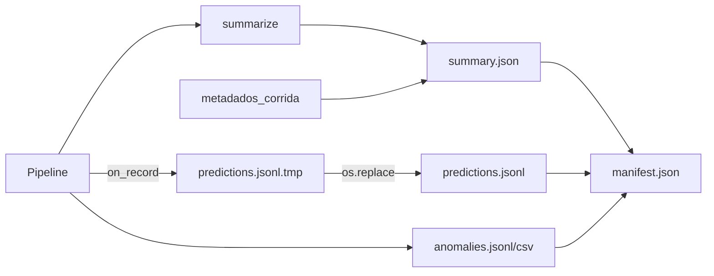

# SPEC-005: Reporting, artefactos e sumários

- **Estado:** implemented (v0.4) + **Fase 1 implemented** (schema, metadados, manifest, integridade); **Fases 2–9 roadmap**
- **Testes:** `tests/test_reporting_summarize.py`, `tests/test_evaluation_metrics.py`, `tests/test_observability.py`, `tests/test_schema_registry.py`, `tests/test_manifest.py`
- **Relacionado:** [SPEC-001](001-retrieval.md) (`sumario_recuperacao`), [SPEC-002](002-grounding.md) (sinais embedding), [SPEC-003](003-judge.md) (`sumario_juiz`, `contexto_juiz`), [SPEC-004](004-aggregation.md) (`flag_anomalia`, `analise_camadas`), [SPEC-006](006-dashboard.md), [SPEC-007](007-pattern-detection.md) (`sumario_padroes`)

## Objetivo

Persistir artefactos **auditáveis e reprodutíveis** por corrida, agregar estatística com **KPI primário** dependente de `reference_type` (`docs/PREMISSAS.md`), e expor caminhos offline (`--analyze-run`, `audit_run.py`) sem misturar ramos diagnósticos num único número.

O harness de reporting é **agnóstico ao corpus**: adaptadores definem referência; o sumário escolhe KPI e avisos, não impõe substring em listas como verdade universal.

## Estado actual (v0.4)

### Módulos e scripts

| Componente | Ficheiro | Função |
|------------|----------|--------|
| Escrita JSONL/CSV | `reporting.py` | `record_to_json`, `write_*`, `summarize` |
| Agregação camadas | `evaluation_metrics.py` | `layer_analysis`, `analyze_run_dir`, `compare_metric_reports` |
| Observabilidade | `observability.py` | `meta.observabilidade` por item; `summarize_run_observability` |
| Orquestração | `pipeline.py` | `on_record` incremental; grava `meta.*` |
| CLI | `cli.py` | Corrida, compare-baselines, `--analyze-run` |
| Auditoria | `scripts/audit_run.py` | Invariantes engenharia + lógica |
| Dashboard dados | `dashboard/data.py` | Leitura `outputs/run_*` |
| **Fase 1** | `schema_registry.py`, `run_artifacts.py` | Versões, manifest, checksums, validação |

### Fluxo de persistência (corrida normal)



1. Durante a corrida: cada `RunRecord` → linha JSON em `.tmp` com `flush` por linha.
2. Ao terminar: `finalize_predictions_jsonl` (rename atómico).
3. `summarize` → `summary.json` (escrita atómica via `.tmp`).
4. `build_manifest` + `write_manifest` com SHA256 dos ficheiros finais.

### Schema `predictions.jsonl` (v1.0)

| Campo | Obrigatório | Descrição |
|-------|-------------|-----------|
| `schema_version` | sim (novas corridas) | `"1.0"` — ausente em corridas legadas |
| `id_item`, `pergunta`, `resposta` | sim | Par Q/A |
| `sinais` | sim | Gold, embedding, juiz (`signals_to_dict`) |
| `meta` | sim | Métricas, contexto juiz, observabilidade |
| `referencias` | se lexical / listas | Truncadas do adaptador |
| `diagnostico` | se SPEC-007 activo | `padroes`, `padrao_primario`, `tier_qualidade` |
| `recuperados` | se RAG | Chunks com score e `e_ouro` |
| `gold_correto`, `flag_anomalia` | sim | Rótulos e detector |

Chaves legadas em inglês (`item_id`, `signals`, …) continuam legíveis em `evaluation_metrics.load_records_from_predictions_jsonl`.

### Schema `summary.json` (v0.4 + v1.0 metadados)

| Campo | Descrição |
|-------|-----------|
| `schema_version` | `"1.0"` (Fase 1) |
| `metadados_corrida` | Git, hash config, dataset, modelos, prompt hashes |
| `tipo_referencia_ativo` | `lexical` \| `answer_lists` \| `none` |
| `kpi_primario` | `sumario_lexical` \| `confusao_vs_referencia` |
| `aviso_metricas` | Quando KPI lexical ≠ confusão gold |
| `protocolo_ativo` | Snapshot `verify_*` + `aggregation.policy` |
| `protocolo_ajustado` | Normalizações de `protocol.py` |
| `detector_activo` | Política + camadas activas |
| `sumario_lexical` | F1 token, EM SQuAD, BLEU/ROUGE |
| `sumario_recuperacao` | SPEC-001 |
| `sumario_padroes` | SPEC-007 |
| `sumario_juiz` | Fallback, schema, tokens |
| `observabilidade` | Tokens/latência agregados |
| `analise_camadas` | Marginais, combinações, κ, Wilson por camada |
| `confusao_vs_referencia` | Matriz detector × referência |
| `ic95_*`, `cohen_kappa_anomalia_vs_gold` | `statistics.py` — **parcial Fase 2** |

### `manifest.json` (Fase 1)

| Campo | Descrição |
|-------|-----------|
| `schema_version` | `"1.0"` |
| `run_id` | Nome do directório `run_*` |
| `criado_em_utc` | ISO8601 |
| `metadados_corrida` | Mesmo bloco que em `summary.json` |
| `dependencias_specs` | `001`–`005`, `007` |
| `ficheiros[]` | `nome`, `tamanho_bytes`, `sha256`, `n_linhas` (jsonl) |
| `integridade.nota` | Checksum por linha = roadmap |

### Comportamento `summarize`

- Escolhe KPI e `aviso_metricas` por `reference_type`.
- Não promove `confusao_vs_gold` como KPI principal em modo `lexical`/`none`.
- Agrega `estratificacao_fp_gold_correto` (decomposição FP por embedding/juiz/gate).
- Delega camadas a `evaluation_metrics.layer_analysis`.
- Observabilidade opcional com custo USD se `OPENAI_PRICE_*` definidos na CLI.

### Ferramentas offline

| Comando | Saída |
|---------|--------|
| `uv run llm-eval --analyze-run outputs/run_*` | `metrics_report.json` |
| `uv run python scripts/audit_run.py [outputs]` | Invariantes + `validate_run_artifacts` |
| Dashboard | Leitura só; `run_integrity_flags` se manifest existir |

## Roadmap (Fases 1–9, itens 1–31)

Legenda: **Impl.** = implementado; **Parc.** = parcial no código actual; **Plan.** = especificado apenas.

---

### Fase 1 — Proveniência e integridade (prioridade máxima)

| # | Item | Problema | TODO checklist | Métricas dashboard (plan.) | Estado | Deps. |
|---|------|----------|----------------|---------------------------|--------|-------|
| 1 | Versão de schema | Corridas antigas ilegíveis após mudança de campos | `schema_registry.py`; `schema_version` em JSONL e summary | Badge versão na sidebar | **Impl.** | — |
| 2 | Metadados de corrida | Impossível reproduzir sem git/config/modelos | `metadados_corrida` em summary; git, hash YAML, dataset | Cartão “proveniência” | **Impl.** | — |
| 3 | Hash de prompts | Drift silencioso de templates | `prompt_hashes_sha256` por ficheiro activo | Diff hashes entre corridas | **Impl.** | SPEC-003 |
| 4 | Escrita atómica | Corrupção se processo morre a meio | `.tmp` + `os.replace` summary e predictions finais | — | **Impl.** | — |
| 5 | SHA256 em manifest | Sem verificação pós-cópia | `build_manifest` / `ficheiros[].sha256` | `checksums_ok` | **Impl.** | — |
| 6 | `manifest.json` | Inventário manual de ficheiros | `write_manifest` após corrida | Lista ficheiros + tamanhos | **Impl.** | — |
| 7 | Validação artefactos | Regressões não detectadas | `validate_run_artifacts`; hook em `audit_run.py` | Alerta integridade | **Impl.** | — |
| 8 | Migração documentada | Quebrar runs antigos | `MIGRATION_NOTES`; modo aviso sem schema | — | **Impl.** | — |

**Dashboard (Fase 1):** `load_manifest_json`, `run_integrity_flags` — `tem_manifest`, `checksums_ok`, `schema_version_*`, `git_commit` (SPEC-006 secção “Integridade” = roadmap UI).

---

### Fase 2 — Distribuições e inferência estatística

| # | Item | Problema | TODO checklist | Métricas dashboard | Estado | Deps. |
|---|------|----------|----------------|-------------------|--------|-------|
| 9 | Histogramas completos | Só médias em `sumario_*` | Serializar percentis P10–P90 por métrica | Histogramas interactivos | **Plan.** | SPEC-006 |
| 10 | Bootstrap IC | Wilson só para proporções | IC bootstrap para F1, BLEU, scores retrieval | Faixas no cartão KPI | **Plan.** | `statistics.py` |
| 11 | Testes significância | Comparar corridas “a olho” | `compare_runs` + teste proporcional / bootstrap diff | p-value na tab Comparar | **Plan.** | #9–10 |
| 12 | Análise por coorte | Efeitos mascarados na média | Segmentar por `padrao_primario`, rank retrieval, idioma | Filtros + tabela coorte | **Parc.** (filtros dashboard) | SPEC-007, 001 |
| 13 | Export distribuições | Re-análise externa | `distributions.json` compacto | Download | **Plan.** | #9 |

**Nota v0.4:** Wilson e Cohen's κ em `summary.json` / `analise_camadas` cobrem parte do espírito da Fase 2 para **proporções** e **concordância**, não para métricas contínuas.

---

### Fase 3 — Latência, custo e falhas

| # | Item | Problema | TODO checklist | Métricas dashboard | Estado | Deps. |
|---|------|----------|----------------|-------------------|--------|-------|
| 14 | Percentis latência | Só total agregado | P50/P95 por papel LLM em summary | Gráfico latência | **Parc.** (`observabilidade` por item) | `observability.py` |
| 15 | Custo por item/camada | Orçamento opaco | Decompor custo estimado juiz vs geração | Cartão custo USD | **Parc.** (custo total opcional) | CLI env |
| 16 | Taxa de falha API | Retries invisíveis no sumário | Agregar timeouts, 429, parse fails | Taxa erro % | **Plan.** | SPEC-003 |
| 17 | SLA de corrida | Runs “zombies” | `duracao_total_s`, `n_itens_falhados` no manifest | Tempo wall-clock | **Plan.** | #6 |

---

### Fase 4 — Rastreio por item e diagnóstico causal

| # | Item | Problema | TODO checklist | Métricas dashboard | Estado | Deps. |
|---|------|----------|----------------|-------------------|--------|-------|
| 18 | `item_trace.jsonl` | Difícil seguir pipeline por id | Linha temporal: retrieve → generate → verify | Timeline no Inspector | **Plan.** | pipeline |
| 19 | Diagnóstico causal | FP sem narrativa | Regras “se embedding baixo e juiz ok → …” | Bullets explicativos | **Parc.** (SPEC-007 tags) | SPEC-007 |
| 20 | Motor correlação | Hipóteses ad hoc | Matriz Spearman métricas vs `flag_anomalia` | Heatmap correlação | **Plan.** | #9 |
| 21 | Links cross-artefacto | Saltar entre ficheiros | IDs estáveis + índice no manifest | Deep links UI | **Plan.** | #6, 18 |

---

### Fase 5 — Discrepância, drift e comparação de corridas

| # | Item | Problema | TODO checklist | Métricas dashboard | Estado | Deps. |
|---|------|----------|----------------|-------------------|--------|-------|
| 22 | Matriz discrepância | Juiz vs gold vs embedding | `disagreement.json` por item | Tab Discrepância | **Plan.** | SPEC-003, 004 |
| 23 | Drift entre runs | Mesmo config, resultados diferentes | Diff metadados + hash prompts + Δ KPI | Alerta drift | **Parc.** (hashes Fase 1) | #2–3 |
| 24 | `scripts/compare_runs.py` | Comparar só via dashboard | CLI tabela + JSON diff summaries | Export comparativo | **Plan.** | `evaluation_metrics.compare_*` |
| 25 | Registo de baseline | Compare-baselines sem manifest rico | Manifest por perfil em subpastas | 4 colunas baseline | **Parc.** | #6 |

---

### Fase 6 — Compressão, export analítico e deduplicação

| # | Item | Problema | TODO checklist | Métricas dashboard | Estado | Deps. |
|---|------|----------|----------------|-------------------|--------|-------|
| 26 | Compressão artefactos | `outputs/` gigante | `.jsonl.gz` opcional pós-corrida | — | **Plan.** | #4 |
| 27 | Export Parquet/DuckDB | BI externo lento em JSONL | `export_run.py` → parquet particionado | — | **Plan.** | — |
| 28 | Dedup de corridas | Runs duplicados | Hash (config+dataset+seed) no manifest | Lista duplicados | **Plan.** | #2 |

---

### Fase 7 — Claim-level, grounding e calibração

| # | Item | Problema | TODO checklist | Métricas dashboard | Estado | Deps. |
|---|------|----------|----------------|-------------------|--------|-------|
| 29 | Relatório por claim | Agregados escondem frases erradas | `claims.jsonl` + cobertura grounding | Tabela claims | **Plan.** | SPEC-002 |
| 30 | Severidade contínua | Booleano grosso | Histograma scores antes do limiar | Slider limiar | **Plan.** | SPEC-004 roadmap |
| 31 | Relatório calibração | FP/FN sem curva | Bins por `juiz_confianca`, F1, embedding | Curva calibração | **Parc.** (tabela calibração dashboard) | SPEC-006 |

---

### Fase 8 — Diagnósticos de dataset, protocolo e leakage

| # | Item | Problema | TODO checklist | Métricas dashboard | Estado | Deps. |
|---|------|----------|----------------|-------------------|--------|-------|
| — | Leakage retrieval | Chunk ouro sempre no top-1 artificialmente | Estatísticas `e_ouro` vs rank; alerta | Cartão leakage | **Plan.** | SPEC-001 |
| — | Protocol mismatch | YAML ≠ `protocolo_ativo` | Assert em `validate_run_artifacts` | Aviso vermelho | **Parc.** | `protocol.py` |
| — | Payload explicabilidade | Anomalia sem contexto exportável | Pacote JSON por item para revisão humana | Export amostra | **Plan.** | SPEC-007 |

*(Itens Fase 8 numerados no plano global como extensões pós-31; mantidos na spec por tema.)*

---

### Fase 9 — Saúde da corrida, alertas e vista executiva

| # | Item | Problema | TODO checklist | Métricas dashboard | Estado | Deps. |
|---|------|----------|----------------|-------------------|--------|-------|
| — | `run_health_score` | Sem síntese go/no-go | Score 0–100 ponderando integridade, KPI, falhas | Gauge saúde | **Plan.** | Fases 1–3 |
| — | Alertas configuráveis | Regressão descoberta tarde | Webhook se FP rate > limiar ou checksum falha | — | **Plan.** | #7, 16 |
| — | Secção executiva | Dashboard técnico demais | 1 página: KPI, custo, saúde, avisos | Tab Executive | **Plan.** | SPEC-006 |

---

## API interna (Fase 1)

```python
# schema_registry.py
PREDICTIONS_SCHEMA_VERSION  # "1.0"
validate_prediction_record(obj, strict=False) -> list[str]

# run_artifacts.py
collect_run_metadata(cfg, config_path=..., run_dir=..., n_records=...)
build_manifest(run_dir, metadados=...) -> dict
validate_run_artifacts(run_dir, strict=False) -> list[str]
atomic_write_json(path, obj)
```

## Compatibilidade e migração

| Situação | Comportamento |
|----------|----------------|
| Corrida sem `schema_version` | Leitura normal; validação emite **aviso** |
| Sem `manifest.json` | `validate_run_artifacts` avisa; dashboard `tem_manifest=false` |
| `summary` só com `baselines` | Validação de schema de summary ignorada (modo compare) |
| KPI por `reference_type` | **Inalterado** — premissa do projecto |

Notas em `schema_registry.MIGRATION_NOTES`.

## Fora de âmbito

- UI completa de integridade (SPEC-006 implementa leitura; gráficos = roadmap).
- Parquet/DuckDB (Fase 6).
- Alterar `flag_anomalia` ou políticas de agregação (SPEC-004).

## Critérios de aceitação

### v0.4 (base)

- [x] `referencias` e `diagnostico` em corridas com SPEC-007.
- [x] `protocolo_ativo` reflecte config pós-`protocol.py`.
- [x] `sumario_padroes` agrega `padrao_primario`.
- [x] `analyze_run_dir` reconstrói relatório sem API.
- [x] Chaves legadas em inglês legíveis no loader.

### Fase 1 (reporting)

- [x] `schema_version` em cada linha `predictions.jsonl` e em `summary.json`.
- [x] `metadados_corrida` com git (se repo), hash config, dataset, modelos, prompt hashes.
- [x] Escrita atómica de `summary.json` e rename atómico de `predictions.jsonl`.
- [x] `manifest.json` com SHA256 e contagens de linhas.
- [x] `validate_run_artifacts` integrado em `audit_run.py` (avisos para legado).
- [x] `dashboard.data.run_integrity_flags` quando manifest presente.
- [x] UI Streamlit mostra cartão integridade (SPEC-006 Fase 1).
- [ ] Checksum por linha JSONL (roadmap documentado).

### Fases 2–9

- [ ] Itens 9–31 conforme tabelas acima (spec-only até priorização).

## Referências de código

| Tópico | Ficheiro |
|--------|----------|
| Sumário | `src/llm_evaluation/reporting.py` |
| Camadas / analyze | `src/llm_evaluation/evaluation_metrics.py` |
| Manifest / checksum | `src/llm_evaluation/run_artifacts.py` |
| Versões schema | `src/llm_evaluation/schema_registry.py` |
| CLI gravação | `src/llm_evaluation/cli.py` |
