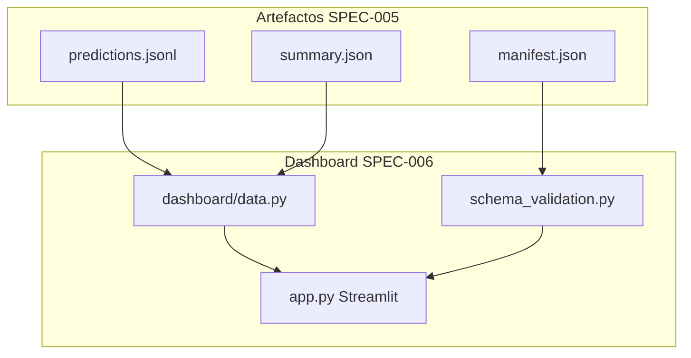
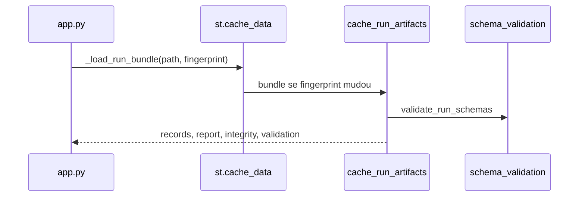

# SPEC-006: Plataforma de observabilidade investigativa (dashboard)

- **Estado:** implemented (v0.4 UI analítica) + **Fase 1 implemented** (validação schema, integridade, cache, paginação); **Fases 2–10 roadmap**
- **Testes:** `tests/test_dashboard_data.py`, `tests/test_dashboard_app.py`, `tests/test_dashboard_schema_validation.py`
- **Relacionado:** [SPEC-001](001-retrieval.md) (tab Recuperação), [SPEC-002](002-grounding.md) (embedding, roadmap claims), [SPEC-003](003-judge.md) (juiz, `sumario_juiz`), [SPEC-004](004-aggregation.md) (`analise_camadas`, calibração), [SPEC-005](005-reporting.md) (manifest, schemas, `run_integrity_flags`), [SPEC-007](007-pattern-detection.md) (padrões, Inspector Q/A)

## Objetivo

Evoluir o visualizador Streamlit local para uma **plataforma de observabilidade investigativa** sobre sistemas generativos: inspecção causal de corridas `outputs/run_*`, comparação científica entre protocolos e trilha de auditoria — **sem executar pipeline nem chamar APIs** (`docs/PREMISSAS.md`).

O dashboard é **camada de leitura** sobre artefactos produzidos por `llm-eval`; a fonte de verdade de métricas permanece em `summary.json` e `predictions.jsonl` ([SPEC-005](005-reporting.md)).

## Visão: além do “viewer Streamlit”

O sistema alvo organiza-se em **camadas funcionais** (não confundir com tabs Streamlit actuais):

| Camada | Papel | Tabs / módulos v0.4 | Roadmap |
|--------|-------|---------------------|---------|
| **Explorer** | Inspecção item a item (Q/A, chunks, sinais) | Inspector Q/A, Inspector JSON, Calibração | Trace Explorer, Claim Explorer, Evidence Viewer |
| **Observatory** | Métricas agregadas e distribuições | Visão geral, Recuperação, Referência, Sinais | Histogramas P10–P90, latência, custo |
| **Diagnostics** | Causa raiz e discordância | Padrões, filtros sidebar, calibração simulada | Root Cause, disagreement quadrants, Hallucination taxonomy |
| **Scientific Lab** | Comparação, significância, drift | Comparar corridas (multiselect) | Significance, drift timeline, cohort analysis |
| **Governance** | Proveniência, integridade, lineage | Sidebar integridade (Fase 1) | Audit trail, experiment tracking |
| **Executive** | KPI não técnico, saúde do produto | `kpi_primario` na Visão geral | Executive Overview, Production Readiness Score |



## Estado actual (v0.4 + Fase 1)

### Comando e entrypoint

| Comando | Módulo | Comportamento |
|---------|--------|---------------|
| `uv run llm-eval-dashboard` | `dashboard/launch.py` | `streamlit run dashboard/app.py` |
| Variável `LLM_EVAL_OUTPUTS` | `data.outputs_root()` | Raiz de `run_*` (default `outputs/`) |

### Módulos

| Componente | Ficheiro | Função |
|------------|----------|--------|
| UI Streamlit | `dashboard/app.py` | Tabs, gráficos Plotly, filtros, badges integridade |
| Carga de dados | `dashboard/data.py` | JSONL/summary, DataFrame, compare, cache, integridade |
| Validação UI | `dashboard/schema_validation.py` | Avisos schema, legado, mismatch |
| Schemas (harness) | `schema_registry.py` | Versões 1.0, validadores partilhados |
| Manifest (harness) | `run_artifacts.py` | SHA256, `validate_run_artifacts` |
| Agregação offline | `evaluation_metrics.py` | `load_full_report`, `analyze_run_dir` |

### Tabs implementadas (v0.4)

| Tab | Camada | Função |
|-----|--------|--------|
| **Visão geral** | Observatory / Executive (parcial) | KPI conforme `kpi_primario`; cartões F1/EM/anomalias; `protocolo_ativo`; aviso métricas |
| **Calibração** | Explorer + Diagnostics | Tabela completa `CALIBRATION_COLUMN_ORDER`; limiares simulados; export CSV; scatter F1 × embedding/recuperação |
| **Inspector Q/A** | Explorer | Layout 2 colunas Q/A/refs vs checklist sinais; badge `padrao_primario` + `tier_qualidade`; chunks expandíveis |
| **Padrões** | Diagnostics | Contagem por tag; co-ocorrência; top falhas F1 |
| **Recuperação** | Observatory | `sumario_recuperacao` (SPEC-001); histogramas score/rank |
| **Sinais** | Observatory | `analise_camadas`: combinações, κ, por camada |
| **Referência** | Observatory | Léxico agregado; scatter F1 × embedding por padrão |
| **Inspector (JSON)** | Explorer | Tabela tabular legada + detalhe JSON |

### Sidebar

- Selector de corrida (ordenado por nome desc).
- **Fase 1:** badges integridade (score 0–100), schema mismatch, corrida legada, checksums, escrita parcial; expander avisos schema.
- Filtros Inspector: multiselect `padrao_primario`; slider `f1_token`; toggles anomalias / FP embedding / recusas.
- Modo comparar várias corridas → tabela `compare_runs`.

### DataFrame (`records_to_dataframe`)

Colunas principais: `f1_token`, `em_squad`, `embedding_*`, `score_melhor_chunk`, `rank_chunk_ouro`, `padrao_primario`, `tier_qualidade`, `padroes`, colunas juiz (`veredito_juiz`, `juiz_fallback`, `juiz_retry_count`, …).

**Fase 1:** colunas opcionais ausentes no JSONL recebem `NA` em vez de quebrar a UI.

### Inspector Q/A (critérios UX)

- Coluna esquerda: pergunta, resposta, `referencias` gold, tier.
- Coluna direita: checklist **determinística** + bloco juiz separado (marcado não-determinístico).
- Chunks: passagem gold em `meta.passagem_ouro_rag`; partes `ouro=True` reconstituídas.
- Sem re-fetch Hub se `referencias` persistidas no JSONL.

## Fase 1 — Robustez estrutural da UI (implementada)

| # | Item | Entrega | UI |
|---|------|---------|-----|
| 1 | Camada `schema_validation.py` | Valida predictions (amostra), summary, manifest, metrics_report | Badges mismatch / legado |
| 2 | Manifest validation | `run_integrity_flags`: checksums, ficheiros em falta, `.tmp` | Score integridade, aviso corrupção |
| 3 | Lazy loading / paginação v1 | Tabelas Calibração e Inspector JSON: 50 linhas/página | Caption “virtualização = roadmap” |
| 4 | Cache inteligente | `cache_run_artifacts` + `artifact_fingerprint`; `@st.cache_data` em `_load_run_bundle` | Spinner reduzido em re-render |

### API Fase 1

```python
# schema_validation.py
validate_run_schemas(run_dir, strict=False) -> dict  # warnings, legacy_run, schema_mismatch, …
validate_metrics_report(obj) -> list[str]

# data.py
artifact_fingerprint(run_dir) -> str
cache_run_artifacts(run_dir) -> dict  # records, report, integrity, validation, …
run_integrity_flags(run_dir) -> dict   # integrity_score, checksums_ok, ficheiros_em_falta, …
clear_run_artifact_cache()             # testes
```

### Regras de integridade (`integrity_score`)

Heurística 0–100 (não bloqueia leitura):

- −50 sem `predictions.jsonl`
- −35 checksums manifest falham
- −25 ficheiros `.tmp` (escrita parcial)
- −15 `schema_mismatch`
- −10 sem manifest
- −5 corrida legada

## Roadmap (Fases 2–10, itens 1–35)

Legenda: **Impl.** = implementado; **Parc.** = parcial; **Plan.** = especificado apenas.

---

### Fase 2 — Investigação profunda de erros

| # | Item | Problema | Widgets planeados | Estado | Deps. |
|---|------|----------|-------------------|--------|-------|
| 5 | Trace Explorer | Debugging sem narrativa causal | Timeline: Pergunta → Retrieval → Chunks → Generation → Judge → Aggregation | **Plan.** | SPEC-005 `item_trace.jsonl` |
| 6 | Claim Explorer | Erros ao nível de frase invisíveis | Tabela Claim / Status / Evidência / Severidade | **Plan.** | SPEC-002 claims |
| 7 | Evidence Viewer | Difícil ver suporte textual | Highlight spans; lado a lado resposta ↔ contexto | **Plan.** | SPEC-002 |
| 8 | Root Cause Explorer | Causas agregadas ad hoc | Heatmap causa → frequência | **Parc.** | SPEC-007 tags |

---

### Fase 3 — Dashboards científicos

| # | Item | Problema | Widgets planeados | Estado | Deps. |
|---|------|----------|-------------------|--------|-------|
| 9 | Calibration dashboard | Só tabela manual hoje | Reliability diagram, ECE, curvas | **Parc.** | tab Calibração, SPEC-004 |
| 10 | Significance dashboard | Comparar corridas “a olho” | p-value, IC bootstrap, run A vs B | **Plan.** | SPEC-005 #9–11, `statistics.py` |
| 11 | Drift dashboard | Regressões entre deploys | Timeline por run/modelo | **Plan.** | manifest hashes |
| 12 | Cohort analysis | Efeitos mascarados na média | Cohort explorer + filtros domínio | **Parc.** | filtros sidebar, SPEC-007 |

---

### Fase 4 — Observabilidade GenAI

| # | Item | Problema | Widgets planeados | Estado | Deps. |
|---|------|----------|-------------------|--------|-------|
| 13 | Grounding Coverage | % claims suportados opaco | Barras Supported / Unsupported | **Plan.** | SPEC-002 |
| 14 | Hallucination Explorer | Taxonomia de alucinação | unsupported / contradicted / evasive | **Plan.** | SPEC-002, 007 |
| 15 | Disagreement analytics | Juiz vs embedding vs léxico | Quadrantes (ex. high cosine + juiz negativo) | **Plan.** | SPEC-003, 004 |
| 16 | Uncertainty explorer | Itens instáveis | Badge “Needs Review” | **Plan.** | SPEC-003 confiança |

---

### Fase 5 — Comparação avançada

| # | Item | Problema | Widgets planeados | Estado | Deps. |
|---|------|----------|-------------------|--------|-------|
| 17 | Compare Runs melhorado | Só KPI agregado | Diff item-level, regressions/gains | **Parc.** | `compare_runs` actual |
| 18 | Benchmark leaderboard | Ranking manual | Por modelo / protocolo / custo | **Plan.** | SPEC-005 metadados |
| 19 | Experiment tracking | Notas de hipótese perdidas | Tags, MLflow-like | **Plan.** | manifest |

---

### Fase 6 — Performance operacional

| # | Item | Problema | Widgets planeados | Estado | Deps. |
|---|------|----------|-------------------|--------|-------|
| 20 | Métricas de custo | Orçamento opaco | Custo juiz / embedding / item | **Parc.** | `observabilidade` summary |
| 21 | Métricas de latência | Só total | Waterfall P95 retrieval/juiz | **Parc.** | `meta.observabilidade` |
| 22 | Health monitoring | Runs degradados | Parse failures, retries | **Parc.** | SPEC-003 `sumario_juiz` |

---

### Fase 7 — UX investigativa

| # | Item | Problema | Widgets planeados | Estado | Deps. |
|---|------|----------|-------------------|--------|-------|
| 23 | Busca semântica local | Procurar em milhares de linhas | Barra search embeddings locais | **Plan.** | offline index |
| 24 | Filtros compostos | Filtros simples insuficientes | Query builder (severity, cosine, claims) | **Parc.** | sidebar actual |
| 25 | Saved views | Reaplicar investigação | Guardar filtros/cohorts | **Plan.** | — |
| 26 | Export investigativo | Só CSV calibração | Parquet, markdown incident package | **Plan.** | SPEC-005 Fase 6 |

---

### Fase 8 — Visualizações avançadas

| # | Item | Problema | Widgets planeados | Estado | Deps. |
|---|------|----------|-------------------|--------|-------|
| 27 | Embeddings visualization | Clusters de falha | UMAP / t-SNE mapa semântico | **Plan.** | embeddings locais |
| 28 | Sankey pipeline | Fluxo opaco | retrieval → grounding → judge → aggregation | **Plan.** | trace |
| 29 | Anomaly network graph | Relações entre padrões | Grafo padrões ↔ causas ↔ chunks | **Plan.** | SPEC-007 |

---

### Fase 9 — Dashboard executivo

| # | Item | Problema | Widgets planeados | Estado | Deps. |
|---|------|----------|-------------------|--------|-------|
| 30 | Executive Overview | Demasiado técnico para stakeholders | Cards confiabilidade, risco, custo | **Plan.** | Fases 1–3 |
| 31 | Production Readiness Score | Sem síntese go/no-go | Gauge 0–100 composto | **Plan.** | #30, SPEC-002/001 |
| 32 | Alertas visuais | Regressão descoberta tarde | Alert center (spike anomalia, drift) | **Plan.** | #11, 22 |

---

### Fase 10 — Observabilidade enterprise

| # | Item | Problema | Widgets planeados | Estado | Deps. |
|---|------|----------|-------------------|--------|-------|
| 33 | Multi-run temporal | Histórico disperso | Evolução KPI por deploy | **Plan.** | vários `run_*` |
| 34 | Governance / audit trail | Quem correu o quê | Lineage: git, config hash, prompts | **Parc.** | SPEC-005 Fase 1 metadados |
| 35 | Explainability Center | Explicação fragmentada | Página única: evidências + claims + juiz + causa | **Plan.** | Fases 2, 4, 8 |

---

## Comportamento técnico

### Fluxo de carga (Fase 1)



1. Utilizador escolhe `run_*` na sidebar.
2. `artifact_fingerprint` combina SHA256 do manifest ou mtime+tamanho de predictions/summary.
3. `cache_run_artifacts` devolve estrutura em memória; invalida se fingerprint mudar.
4. `records_to_dataframe` + tabs existentes; tabelas grandes paginam a 50 linhas.

### Paginação e virtualização

- **v1 (Impl.):** `st.number_input` de página + slice DataFrame; aplicado a Calibração e Inspector JSON.
- **Roadmap:** tabelas virtualizadas (ex. `streamlit-aggrid` ou componente custom) para JSONL com 10k+ linhas; streaming reader linha a linha sem carregar tudo em RAM.

### Cache

| Camada | Chave invalidação |
|--------|-------------------|
| `cache_run_artifacts` | `artifact_fingerprint` |
| `@st.cache_data _load_run_bundle` | `run_dir` + `fingerprint` |

### Validação de schema

- Reutiliza `schema_registry.validate_*` em modo **aviso** (não bloqueia UI).
- Amostra até 5 linhas de `predictions.jsonl` por defeito (performance).
- `legacy_run`: sem manifest ou sem `schema_version` em summary/amostra.
- `schema_mismatch`: versões divergentes entre summary, manifest e predictions.

## Integração com outras specs

| Spec | Consumo no dashboard |
|------|----------------------|
| [001](001-retrieval.md) | `score_melhor_chunk`, `rank_chunk_ouro`, tab Recuperação |
| [002](002-grounding.md) | Colunas embedding; roadmap claims/evidence |
| [003](003-judge.md) | Colunas juiz, expander CoT legado, `sumario_juiz` futuro |
| [004](004-aggregation.md) | `flag_anomalia`, `analise_camadas`, simulação política na Calibração |
| [005](005-reporting.md) | `manifest.json`, metadados, integridade, schemas |
| [007](007-pattern-detection.md) | `padrao_primario`, `padroes`, tab Padrões |

**Premissas respeitadas:**

- UI **read-only**; não invoca `pipeline` nem APIs LLM.
- Três ramos pós-resposta **não** fundidos num KPI único na UI (cartões separados).
- `reference_type` define avisos (`kpi_primario` vs confusão gold).

## Fora de âmbito

- Executar pipeline ou editar YAML na UI.
- Deploy cloud, autenticação multi-utilizador, RBAC.
- Fases 2–10 como páginas completas até artefactos e specs upstream existirem.
- Substituir `audit_run.py` ou `validate_run_artifacts` — o dashboard **espelha** avisos, não redefine invariantes.

## Critérios de aceitação

### v0.4 (base)

- [x] `dashboard.data` importável sem servidor Streamlit (CI).
- [x] Inspector mostra Q/A + referências sem JSON bruto como única vista.
- [x] Filtro por `padrao_primario` reduz lista de itens em tempo real.
- [x] Scatter F1 × embedding quando colunas existem.
- [x] Visão geral mostra `protocolo_ativo` do `summary.json`.
- [x] Tab Calibração com export CSV e simulação de limiares.
- [x] Colunas juiz robustas (`juiz_retry_count`, `juiz_schema_invalid`, …).

### Fase 1 (robustez estrutural)

- [x] `dashboard/schema_validation.py` com avisos para predictions, summary, manifest, metrics_report.
- [x] Badges sidebar: schema mismatch, corrida legada, integridade (score), checksums / parcial.
- [x] `run_integrity_flags` com `integrity_score`, ficheiros em falta, escrita parcial.
- [x] `cache_run_artifacts` invalidado por fingerprint de manifest/mtimes.
- [x] Paginação 50 linhas em tabelas Calibração e Inspector JSON.
- [x] `records_to_dataframe` tolera colunas opcionais ausentes (`NA`).
- [x] Testes `test_dashboard_schema_validation.py` + extensão `test_dashboard_data.py`.

### Fases 2–10 (roadmap)

- [ ] Itens 5–35 conforme tabelas acima.
- [ ] Trace Explorer (item 5) quando `item_trace.jsonl` existir ([SPEC-005](005-reporting.md) Fase 4).
- [ ] Tab Executive (itens 30–32) após agregados de saúde/custo em summary.
- [ ] Virtualização completa de tabelas grandes (substituir paginação v1).

## Referências de código

| Área | Ficheiro |
|------|----------|
| UI principal | `src/llm_evaluation/dashboard/app.py` |
| Dados + cache | `src/llm_evaluation/dashboard/data.py` |
| Validação | `src/llm_evaluation/dashboard/schema_validation.py` |
| CLI dashboard | `src/llm_evaluation/dashboard/launch.py` |
| Schemas | `src/llm_evaluation/schema_registry.py` |
| Manifest | `src/llm_evaluation/run_artifacts.py` |
