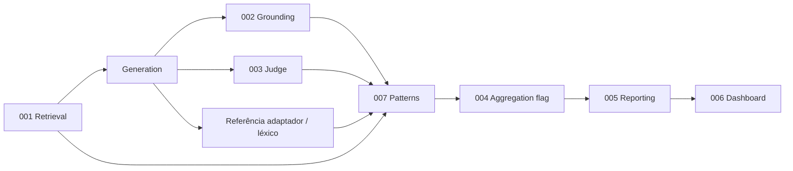

# SPEC-007: Detecção determinística de padrões

- **Estado:** implemented (v0.4) + **Fase 1** (registry, YAML, `catalog_version`) implementada; **Fases 2–10** roadmap
- **Testes:** `tests/test_pattern_detection.py`
- **Depende de:** [SPEC-001](001-retrieval.md), [SPEC-002](002-grounding.md), [SPEC-004](004-aggregation.md), [SPEC-005](005-reporting.md)
- **Consumido por:** [SPEC-005](005-reporting.md) (`sumario_padroes`), [SPEC-006](006-dashboard.md) (Inspector, tab Padrões)

## Objetivo

Atribuir a cada item um conjunto de **rótulos determinísticos** (regras fixas, **sem LLM**) que expliquem qualidade, falhas estruturais e alertas espelhados. O dashboard e o relatório usam estes rótulos para filtrar, ordenar e inspecionar pares pergunta–resposta **sem** depender só do juiz ou de KPIs agregados opacos.

**Premissa central** (`docs/PREMISSAS.md`): padrões são **diagnóstico explicativo**; na v1 **não** alteram `flag_anomalia` nem a política de agregação ([SPEC-004](004-aggregation.md)). A ligação futura padrão → severidade de alerta está reservada à **Fase 8** (ver roadmap).

## Posição na arquitectura de camadas

O harness segue o fluxo documentado em `docs/ARCHITECTURE.md`. A detecção de padrões situa-se **depois** das três ramificações pós-resposta e **antes** da agregação formal no relatório (que já consumiu `flag_anomalia` no pipeline):



| Camada | SPEC | Entrada para padrões | Saída usada por 007 |
|--------|------|----------------------|---------------------|
| Retrieval | 001 | `meta.metricas_recuperacao` | `recuperacao_falhou` |
| Grounding | 002 | `sinais.embedding_baixo_suporte`, `gold_correto` | `grounding_*` |
| Judge | 003 | `juiz_negativo`, `fallback_heuristico` | `juiz_*` |
| **Patterns** | **007** | Resposta + meta + sinais | `meta.diagnostico` |
| Aggregation | 004 | — | Só espelha `anomalia` |
| Reporting | 005 | `diagnostico` por item | `sumario_padroes` |
| Dashboard | 006 | JSONL + summary | Filtros, badges, gráficos |

## Implementação actual (v0.4 + Fase 1)

### Módulos

| Ficheiro | Função |
|----------|--------|
| `src/llm_evaluation/pattern_registry.py` | Catálogo versionado, prioridade, `get_catalog()`, merge de overrides |
| `src/llm_evaluation/pattern_detection.py` | `compute_diagnostico`, `has_placeholder` |
| `src/llm_evaluation/config.py` | `PatternsConfig`, secção YAML opcional `patterns:` |
| `src/llm_evaluation/pipeline.py` | Invoca `compute_diagnostico` no fim de `_run_one_with_resources` |
| `src/llm_evaluation/orchestration/multi.py` | Idem no ramo multi-agente |
| `src/llm_evaluation/reporting.py` | `_pattern_summary()` → `sumario_padroes` |

### Momento de cálculo

Em `pipeline._run_one_with_resources`, **após** métricas léxicas, recuperação, juiz e cálculo de `anomaly_flag`, e **antes** de construir `RunRecord`:

1. Monta `meta` com `metricas_recuperacao`, `metricas_lexicas`, `referencias`, etc.
2. Chama `compute_diagnostico(..., pattern_overrides=cfg.patterns.overrides)`.
3. Grava resultado em `meta["diagnostico"]` (também espelhado no topo do JSONL via `evaluation_metrics` / `reporting`).

### Entradas

| Fonte | Campos / funções |
|-------|------------------|
| `EvalItem` | `correct_answers`, `rag_gold_chunk` (indirecto via métricas) |
| Resposta | `answer` (texto modelo) |
| `VerificationSignals` | `gold_correct`, `embedding_low_support`, `judge`, `judge_negative` |
| `meta` | `metricas_lexicas` / `lexical_metrics`, `metricas_recuperacao` / `retrieval_metrics` |
| `anomaly_flag` | Booleano já calculado pela agregação — **só espelhado** em `anomalia` |

### Saídas por item (`meta.diagnostico`)

| Campo | Tipo | Descrição |
|-------|------|-----------|
| `catalog_version` | `str` | Versão do catálogo (ex.: `"1.0"`) — Fase 1 |
| `padroes` | `list[str]` | Tags activas |
| `padrao_primario` | `str` | Um rótulo dominante por prioridade do registry |
| `tier_qualidade` | enum | `alta` \| `media` \| `baixa` \| `indeterminada` |
| `padroes_meta` | `list[object]` | Por tag activa: `{id, categoria, severidade}` — Fase 1 |

### Saída agregada (`summary.json`)

Chave `sumario_padroes` ([SPEC-005](005-reporting.md)):

| Campo | Descrição |
|-------|-----------|
| `catalog_version` | Versão propagada dos itens (Fase 1) |
| `por_padrao_primario` | Contagens por rótulo primário |
| `por_tag` | Contagens por tag (co-ocorrências possíveis) |

### Catálogo de padrões (registry v1.0)

Implementação canónica: `pattern_registry.get_catalog()`. Overrides YAML por ID (ex.: `patterns.referencia_forte.f1_min`).

| ID | Categoria | Severidade | Determinístico | Regra (resumo) |
|----|-----------|------------|----------------|----------------|
| `resposta_vazia` | estrutural | critico | sim | `not answer.strip()` |
| `placeholder` | estrutural | critico | sim | Regex `<[^>]+>` ou frases-tipo |
| `recusa` | estrutural | medio | sim | `is_refusal(answer)` |
| `recuperacao_falhou` | recuperacao | critico | sim | RAG activo, corpus com ouro, ouro fora top-k |
| `grounding_fp_suspeito` | grounding | alto | sim | `gold_correto` ∧ `embedding_baixo_suporte` |
| `grounding_baixo` | grounding | medio | sim | `embedding_baixo_suporte` |
| `referencia_ausente` | referencia | alto | sim | `f1_token < f1_fraca_min` (com refs) |
| `referencia_fraca` | referencia | medio | sim | `f1_fraca_min ≤ f1 < f1_forte_min` |
| `referencia_forte` | referencia | baixo | sim | `em_squad` ou `f1 ≥ f1_forte_min` |
| `juiz_fallback` | verificacao | medio | sim | `fallback_heuristico` no raw do juiz |
| `juiz_negativo` | verificacao | alto | sim | `juiz_negativo` (UI: não-determinístico) |
| `anomalia` | verificacao | alto | sim | `flag_anomalia` (espelho) |
| `ok` | sintese | informativo | sim | Primário quando nenhum problema |

**Limiares default (F1 token):** forte `0.8`, fraco `0.3`. Configuráveis via YAML (Fase 1).

### Prioridade de `padrao_primario`

Ordem fixa no registry (`priority_order()`); primeiro match na lista `padroes` ganha:

1. `resposta_vazia` → 2. `placeholder` → 3. `recusa` → 4. `recuperacao_falhou` → 5. `grounding_fp_suspeito` → 6. `grounding_baixo` → 7. `referencia_ausente` → 8. `referencia_fraca` → 9. `referencia_forte` → 10. `juiz_fallback` → 11. `juiz_negativo` → 12. `anomalia` → 13. `ok`

Nota: na v0.4 anterior, `grounding_fp_suspeito` precedia `grounding_baixo` — mantido no registry.

### `tier_qualidade` (heurística UI)

| Tier | Condição (simplificada) |
|------|-------------------------|
| `baixa` | vazio, placeholder, recuperação falhou, referência ausente, ou recusa sem referência forte |
| `alta` | `referencia_forte` sem `grounding_baixo` |
| `media` | referência fraca, grounding FP suspeito, ou fallback |
| `indeterminada` | Sem referências ou F1 indisponível |

### Configuração YAML (Fase 1)

Secção opcional na raiz do config:

```yaml
patterns:
  referencia_forte:
    f1_min: 0.8
  referencia_fraca:
    f1_min: 0.3
  # referencia_ausente:
  #   f1_max: 0.3   # sinónimo do limiar fraco
  # placeholder:
  #   frases: ["specific winner", "check latest"]
```

Exemplo comentado em `configs/default.yaml`. Chaves desconhecidas são ignoradas; omitir `patterns` ≡ defaults do registry.

### Comportamento garantido (v1)

- **Determinístico:** mesma entrada JSONL → mesmos `padroes` e `padrao_primario`.
- **Não muta agregação:** `compute_diagnostico` não escreve `flag_anomalia`.
- **Juiz espelhado:** tags `juiz_*` documentam camada LLM; dashboard separa checklist determinístico vs juiz ([SPEC-006](006-dashboard.md)).
- **Compatibilidade:** corridas antigas sem `catalog_version` continuam legíveis; reporting assume `1.0` se ausente.

## Arquitectura ideal (alvo multi-fase)

Além da taxonomia estrutural actual, o alvo inclui:

| Capacidade | Descrição |
|------------|-----------|
| Rationale estruturado | Por padrão: `evidencia` (campos meta citados), `limiar_aplicado` |
| Claim-level | Padrões por frase/alinhamento ([SPEC-002](002-grounding.md) split) |
| Co-ocorrência | Matriz tag×tag no `summary.json` |
| Drift / versão | `pattern_catalog_version` + diff entre corridas |
| Explorer UI | Tab dedicada com co-ocorrência e export CSV |
| Política opcional | Padrões críticos → peso em alerta (Fase 8, opt-in) |

Persistência alvo em `meta.diagnostico`:

```json
{
  "catalog_version": "1.0",
  "padroes": ["grounding_fp_suspeito", "referencia_forte"],
  "padrao_primario": "grounding_fp_suspeito",
  "tier_qualidade": "media",
  "padroes_meta": [{"id": "grounding_fp_suspeito", "categoria": "grounding", "severidade": "alto"}],
  "rationale": []
}
```

## Roadmap — Fases 1–10 (itens 1–30)

Legenda: **Impl** = implementado; **Plan** = especificado, por implementar.

### Fase 1 — Taxonomia estrutural robusta (itens 1–3)

| # | Item | Problema | TODO | Dashboard | Estado |
|---|------|----------|------|-----------|--------|
| 1 | `pattern_catalog_version` | Corridas incomparáveis sem versão | Persistir `catalog_version` em `diagnostico` e `sumario_padroes` | Badge de versão na tab Padrões | **Impl** |
| 2 | `pattern_registry.py` | Limiares hardcoded dispersos | Registry com categoria, severidade, prioridade, `get_catalog()` | Tooltip com descrição por ID | **Impl** |
| 3 | Overrides YAML mínimos | Ajuste de F1 por dataset sem fork de código | `patterns.<id>.f1_min` em config | — | **Impl** |

### Fase 2 — Metadados formais por tag (itens 4–6)

| # | Item | Problema | TODO | Dashboard | Estado |
|---|------|----------|------|-----------|--------|
| 4 | `padroes_meta` completo | UI não sabe severidade sem lookup externo | Incluir `descricao_curta` opcional | Cor por severidade | **Impl** (parcial: sem descrição) |
| 5 | Export catálogo estático | Dashboard duplica tabela | `get_catalog()` servido via JSON em `manifest` ou doc gerado | Link «legenda» | Plan |
| 6 | Validação de overrides | YAML inválido silencioso | Log aviso + fallback a default em `build_pattern_settings` | — | Plan |

### Fase 3 — Rationale estruturado (itens 7–9)

| # | Item | Problema | TODO | Dashboard | Estado |
|---|------|----------|------|-----------|--------|
| 7 | Campo `rationale` | Utilizador não vê *porquê* | Lista `{padrao, campo, valor, limiar}` | Expander por item no Inspector | Plan |
| 8 | Limiar efectivo no rationale | Overrides opacos | Gravar `f1_forte_min` resolvido por item | — | Plan |
| 9 | Testes de snapshot rationale | Regressão de explicação | Fixture JSONL golden | — | Plan |

### Fase 4 — Claim-level e frases (itens 10–12)

| # | Item | Problema | TODO | Dashboard | Estado |
|---|------|----------|------|-----------|--------|
| 10 | Split de frases | FP grounding só na conclusão | Reutilizar split de `embedding_verify.py` | Heatmap frase×chunk | Plan |
| 11 | Tags `grounding_baixo_claim` | Agregado esconde falha local | Padrão por frase com score < limiar | — | Plan |
| 12 | Alinhamento com SPEC-002 Fase B | Duplicação de lógica | Importar scores por frase já calculados | — | Plan |

### Fase 5 — Co-ocorrência e estatística (itens 13–15)

| # | Item | Problema | TODO | Dashboard | Estado |
|---|------|----------|------|-----------|--------|
| 13 | Matriz co-ocorrência | Tags independentes na UI | `sumario_padroes.co_ocorrencia` | Heatmap na tab Padrões | Plan |
| 14 | Lift / PMI simples | Pares frequentes por acaso | Contagem condicional no reporting | Ordenar pares surpresa | Plan |
| 15 | Estratificação por `reference_type` | KPI mistura protocolos | Secção por tipo em summary | Filtro protocolo | Plan |

### Fase 6 — Drift e comparação de corridas (itens 16–18)

| # | Item | Problema | TODO | Dashboard | Estado |
|---|------|----------|------|-----------|--------|
| 16 | Diff de distribuição primária | Regressão silenciosa entre runs | `compare_runs` inclui Δ `por_padrao_primario` | Tab Comparar | Plan |
| 17 | Alerta de mudança de catálogo | Versões diferentes invalidam comparação | Aviso se `catalog_version` difere | Banner | Plan |
| 18 | Histórico por `id_item` | Mesmo item em várias corridas | Join opcional por ID | Linha temporal | Plan |

### Fase 7 — Pattern explorer (itens 19–21)

| # | Item | Problema | TODO | Dashboard | Estado |
|---|------|----------|------|-----------|--------|
| 19 | Tab explorer dedicada | Tab Padrões só contagens | Tabela filtrável + export CSV | Nova sub-tab | Plan |
| 20 | Filtro composto | AND de tags | Multiselect `padroes` (não só primário) | Sidebar | Plan |
| 21 | Amostragem estratificada | Review manual longo | «N exemplos por tag» | Botão amostra | Plan |

### Fase 8 — Ligação opcional a alerta (itens 22–24)

| # | Item | Problema | TODO | Dashboard | Estado |
|---|------|----------|------|-----------|--------|
| 22 | **Não alterar `flag_anomalia` por defeito** | Premissa PREMISSAS | Manter espelho `anomalia` apenas | Documentar na UI | **Impl** (política) |
| 23 | Modo `patterns.influencia_alerta` | Equipa quer OR com tags críticas | Opt-in YAML: OR `resposta_vazia` \| … | Toggle experimental | Plan |
| 24 | Replay offline de política | Medo de mudar produção | Script sem re-gerar LLM ([SPEC-004](004-aggregation.md) replay) | — | Plan |

### Fase 9 — Internacionalização e adaptadores (itens 25–27)

| # | Item | Problema | TODO | Dashboard | Estado |
|---|------|----------|------|-----------|--------|
| 25 | Frases placeholder PT | Fairytale pt-BR | Lista `placeholder.frases` por locale | — | Plan |
| 26 | Padrão `referencia_listas` | `answer_lists` usa listas, não F1 | Tag quando `reference_type: answer_lists` | — | Plan |
| 27 | Spec por adaptador | Regras NQ ≠ TQA | `docs/specs/adapters/*.md` cross-ref | — | Plan |

### Fase 10 — Qualidade e observabilidade (itens 28–30)

| # | Item | Problema | TODO | Dashboard | Estado |
|---|------|----------|------|-----------|--------|
| 28 | Cobertura pytest E2E | Só unitários isolados | `test_pipeline_e2e_mock` assert `catalog_version` | — | Plan |
| 29 | Métricas de tempo | Custo desprezável hoje | Contador opcional em `observabilidade` | — | Plan |
| 30 | Auditoria `audit_run.py` | Corridas sem diagnostico | Validação schema `diagnostico` obrigatório | — | Plan |

## Integração cross-spec

### SPEC-002 (Grounding)

- Entrada: `embedding_low_support`, `gold_correct`.
- Padrões: `grounding_baixo`, `grounding_fp_suspeito`.
- Futuro: scores por frase alimentam Fase 4.

### SPEC-004 (Agregação)

- `anomalia` espelha `flag_anomalia`; **não** recalcula política.
- Fase 8: política opcional `patterns.influencia_alerta` — **fora** do scope v1.

### SPEC-005 (Reporting)

- `summarize()` → `sumario_padroes` com `catalog_version`.
- `kpi_diagnostico_primario` aponta para KPI léxico ou confusão conforme protocolo; padrões são ramo paralelo.

### SPEC-006 (Dashboard)

- `records_to_dataframe`: `padrao_primario`, `tier_qualidade`.
- Inspector: badge primário + tier; checklist determinístico.
- Tab Padrões: `por_padrao_primario`, `por_tag`; scatter F1 × embedding colorido por padrão.

## Fora de âmbito (v1)

- Clustering ML de falhas.
- Detecção de idioma por modelo externo.
- LLM para rotular padrões.
- KPI único que misture padrões + juiz + léxico.

## Critérios de aceitação

### v0.4 (base)

- [x] Cada item com métricas léxicas activas grava `meta.diagnostico`.
- [x] `padrao_primario` é único e reproduzível dado o mesmo JSONL.
- [x] Testes cobrem: placeholder, recusa, `grounding_fp_suspeito`, `referencia_forte`, `recuperacao_falhou`.
- [x] SPEC-006 consome `padrao_primario` e `tier_qualidade` no DataFrame.

### Fase 1 (registry)

- [x] `catalog_version` em `meta.diagnostico` e `sumario_padroes`.
- [x] `pattern_registry.get_catalog()` exporta catálogo completo.
- [x] Overrides YAML `patterns.referencia_forte.f1_min` alteram classificação (teste).
- [x] `padroes_meta` por tag activa.
- [x] Comportamento default idêntico ao v0.4 sem secção `patterns`.

### Roadmap (Fases 2–10)

- [ ] Rationale estruturado por padrão.
- [ ] Co-ocorrência no summary.
- [ ] Claim-level patterns.
- [ ] Pattern explorer com export CSV.
- [ ] Opt-in `influencia_alerta` documentado e testado.

## Referências de código

- Registry: `src/llm_evaluation/pattern_registry.py`
- Detecção: `src/llm_evaluation/pattern_detection.py`
- Pipeline: `src/llm_evaluation/pipeline.py` (`compute_diagnostico`)
- Reporting: `src/llm_evaluation/reporting.py` (`_pattern_summary`)
- Config: `src/llm_evaluation/config.py` (`PatternsConfig`)
- Testes: `tests/test_pattern_detection.py`
