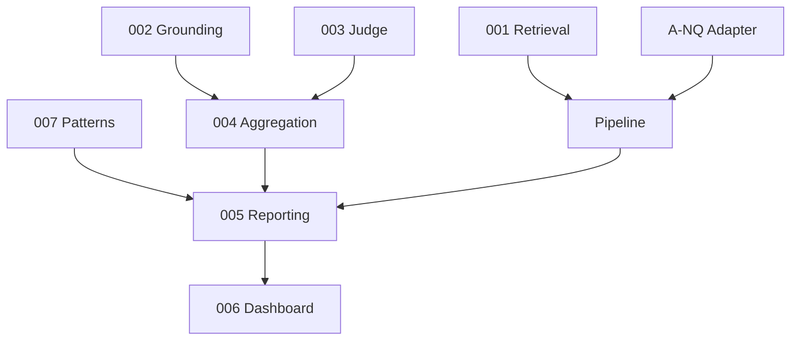

# Especificações (spec-driven development)

Cada spec é a **fonte de verdade** do comportamento. Implementação e testes devem cumprir os critérios de aceitação antes do merge.

**Revisão 2026-05-16 (v0.4 planeada):** grounding calibrado, padrões determinísticos (007), agregação alargada, dashboard Inspector Q/A. Ver plano interno *Pipeline e dashboard*.

## Template

```markdown
# SPEC-NNN: Título

- **Estado:** proposed | implemented | deprecated
- **Testes:** `tests/test_….py`

## Objetivo
## Entradas e saídas
## Comportamento
## Fora de âmbito
## Critérios de aceitação
```

## Índice

| ID | Spec | Estado |
|----|------|--------|
| 001 | [Retrieval](001-retrieval.md) | implemented |
| 002 | [Grounding](002-grounding.md) | implemented |
| 003 | [Juiz LLM](003-judge.md) | implemented (Fase 1 robustez); Fases 2–8 roadmap |
| 004 | [Agregação](004-aggregation.md) | implemented (v0.4); roadmap fases A–E |
| 005 | [Reporting](005-reporting.md) | implemented (Fase 1 proveniência); Fases 2–9 roadmap |
| 006 | [Dashboard](006-dashboard.md) | implemented (Fase 1 robustez UI); Fases 2–10 roadmap |
| 007 | [Padrões determinísticos](007-pattern-detection.md) | implemented (Fase 1 registry); Fases 2–10 roadmap |
| A-NQ | [Adaptador Natural Questions](adapters/natural-questions.md) | implemented |

## Mapa de dependências



## Protocolos de corrida (configs)

| Config | reference_type | KPI primário | Anomalia |
|--------|----------------|--------------|----------|
| `smoke_amostra.yaml` | `lexical` | `sumario_lexical` | `embedding_e_juiz` |
| `default.yaml` | `lexical` | `sumario_lexical` | `embedding_e_juiz` |
| `ptbr_fairytale_full.yaml` | `lexical` | léxico + recuperação | `embedding_e_juiz` |
| `ptbr_fairytale_tuned.yaml` | `lexical` | léxico + recuperação | `embedding_e_juiz` |

Fluxo de PR: ver [`../CONTRIBUTING.md`](../CONTRIBUTING.md).
